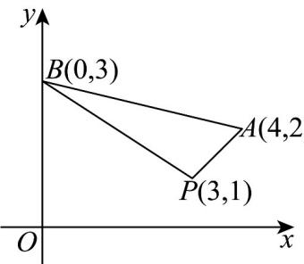

> [!faq]- 《专题07 直线交点坐标与各种距离全方位总结（九大题型）（高效培优期中专项训练）数学人教A版2019高二选择性必修第一册》官方解析
>
> > [!success]- **【答案】** $\left(-\infty, -\frac{2}{3}\right] \cup [1, +\infty)$
>
> > [!note]- **【分析】**
> > 首先求直线所过的定点，再求边界的斜率，再利用数形结合，写出范围·
>
> > [!note]- **【解析】**
> > $mx - y - 3m + 1 = 0$ ，得 $m(x - 3) - y + 1 = 0$ ，所以直线 $l$ 过点 $P(3,1)$
> >
> > 
> >
> > $$
> > k _ {P A} = \frac {2 - 1}{4 - 3} = 1
> > $$
> >
> > $$
> > k _ {P B} = \frac {3 - 1}{0 - 3} = - \frac {2}{3}
> > $$
> >
> > 若直线 $l$ 与线段 $AB$ 有公共点，所以直线斜率 $m$ 的取值范围是 $\left(-\infty, -\frac{2}{3}\right] \cup [1, +\infty)$ .
> >
> > 故答案为： $\left(-\infty , - \frac{2}{3}\right]\cup [1, + \infty)$
> >
> > 12. 平面直角坐标系 $xOy$ 中，过直线 $l_{1}:7x - 3y + 1 = 0$ 与 $l_{2}:x + 4y - 3 = 0$ 的交点，且在 $y$ 轴上截距为 1 的直线 $l$ 的方程为 \_\_\_\_.（写成一般式）
> >
> > 【答案】 $9x+5y-5=0$
> >
> > 【分析】设交点系方程，结合直线过 $(0,1)$ 求方程即可·
> >
> > 【详解】由题设，令直线 l 的方程为 $7x - 3y + 1 + \lambda(x + 4y - 3) = 0$ ，且直线过 $(0, 1)$ ，所以 $0 - 3 + 1 + \lambda(0 + 4 - 3) = 0 \Rightarrow \lambda = 2$ ，故直线 l 的方程为 $9x + 5y - 5 = 0$ 。
> >
> > 故答案为： $9x + 5y - 5 = 0$
> >
> > 13. 直线 $l_{1}: x + (m + 1)y - 2m - 2 = 0$ 与直线 $l_{2}: (m + 1)x - y - 2m - 2 = 0$ 相交于点 $P$ ，对任意实数 $m$ ，直线 $l_{1}, l_{2}$ 分别恒过定点 $A, B$ ，则 $\left|PA\right| + \left|PB\right|$ 的最大值为（） A.4 B.8 C. $2\sqrt{2}$ D. $4\sqrt{2}$
> >
> > 【答案】A
> >
> > 【分析】首先求点 $A, B$ 的坐标，并判断两条直线的位置关系，结合基本不等式，即可求解
> >
> > 【详解】直线 $l_{1}: x + y - 2 + m(y - 2) = 0$ ，当 $\left\{ \begin{array}{l} y - 2 = 0 \\ x + y - 2 = 0 \end{array} \right.$ ，得 $\left\{ \begin{array}{l} x = 0 \\ y = 2 \end{array} \right.$ ，
> >
> > 即点 $A(0,2)$
> >
> > 直线 $l_{2}:x - y - 2 + m(x - 2) = 0$ ，当 $\left\{ \begin{array}{l}x - y - 2 = 0\\ x - 2 = 0 \end{array} \right.$ ，得 $\left\{ \begin{array}{l}x = 2\\ y = 0 \end{array} \right.$ ，即点 $B(2,0)$
> >
> > 且两条直线满足 $1 \times (m + 1) + (m + 1) \times (-1) = 0$ ，所以 $l_{1} \perp l_{2}$ ，即 $PA \perp PB$
> >
> > $\left|PA\right|^2 +\left|PB\right|^2 = \left|AB\right|^2 = 8$
> >
> > $\left|PA\right| + \left|PB\right|\leq \sqrt{2\left(\left|PA\right|^2 + \left|PB\right|^2\right)} = 4$ ，当 $\left|PA\right| = \left|PB\right|$ 时，等号成立，
> >
> > 所以 $\left|PA\right|+\left|PB\right|$ 的最大值为4.
> >
> > 故选 **A**
