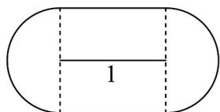

> [!faq]- 《专题07 直线交点坐标与各种距离全方位总结（九大题型）（高效培优期中专项训练）数学人教A版2019高二选择性必修第一册》官方解析
>
> > [!success]- **【答案】** $4 + \pi$
>
> > [!note]- **【分析】**
> > 先分析出该集合所对应的图形形状，再分别计算各部分图形的面积，最后将各部分面积相加得到总面积·
>
> > [!note]- **【解析】**
> > 已知集合 $D = \{P \mid d(P, l) \leq 1\}$ 所表示的图形是一个边长为2的正方形和两个半径是1的半圆·如图所
> >
> > 示·
> >
> > 将正方形面积和圆的面积相加，可得点集 $D$ 所表示图形的面积 $S = S_{\text{正方形}} + S_{\text{圆}} = 4 + \pi$
> >
> > 故答案为： $4 + \pi$
> >
> > 
