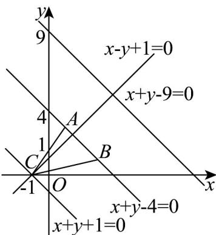

> [!faq]- 《专题07 直线交点坐标与各种距离全方位总结（九大题型）（高效培优期中专项训练）数学人教A版2019高二选择性必修第一册》官方解析
>
> > [!success]- **【答案】** (1) $x - y + 1 = 0$ (2) $m+n-9=0$ 或 $m+n+1=0$
>
> > [!note]- **【分析】**
> > （1）求出 $k_{AB}$ ，即可得到边 $AB$ 的高所在直线的斜率 $k = -\frac{1}{k_{AB}}$ ，再由点斜式计算可得；
> >
> > (2) 首先求出直线 $AB$ 的方程与 $\left|AB\right|$ ，设点 $C$ 到直线 $AB$ 的距离为 $d$ ，由面积公式求出 $d$ ，再利用点到直线的距离公式计算可得：
>
> > [!note]- **【解析】**
> > （1）因为 $A(1,3), B(3,1)$ ，所以 $k_{AB} = \frac{3 - 1}{1 - 3} = -1$ ，
> >
> > 当 $m = -1, n = 0$ 时 $C(-1,0)$ ，所以边 $AB$ 的高所在直线的斜率 $k = -\frac{1}{k_{AB}} = 1$
> >
> > 所以边 $AB$ 的高所在的直线方程为 $y - 0 = 1 \times [x - (-1)]$ ，即 $x - y + 1 = 0$ ；
> >
> > (2) 因为直线 AB 的方程为 $y-3=-1(x-1)$ ，即 $x+y-4=0$ ，
> >
> > 又 $|AB| = \sqrt{(1-3)^2 + (3-1)^2} = 2\sqrt{2}$
> >
> > 设点 $C$ 到直线 $AB$ 的距离为 $d$ ，因为 $\mathrm{VABC}$ 的面积为 $5$ ，所以 $\frac{1}{2} |AB| d = 5$ ，即 $\frac{1}{2} \times 2\sqrt{2} d = 5$ ，解得 $d = \frac{5\sqrt{2}}{2}$ ；又 $d = \frac{|m + n - 4|}{\sqrt{1^2 + 1^2}} = \frac{5\sqrt{2}}{2}$ ，则 $m + n - 4 = 5$ 或 $m + n - 4 = -5$ ，即 $m + n - 9 = 0$ 或 $m + n + 1 = 0$ ，
> >
> > 所以点 C 的坐标满足的关系为 $m + n - 9 = 0$ 或 $m + n + 1 = 0$ .
> >
> > 
