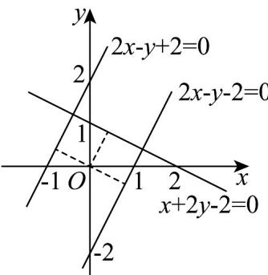

> [!faq]- 《专题07 直线交点坐标与各种距离全方位总结（九大题型）（高效培优期中专项训练）数学人教A版2019高二选择性必修第一册》官方解析
>
> > [!success]- **【答案】** D
>
> > [!note]- **【分析】**
> > 由点到直线的距离公式即可求解·
>
> > [!note]- **【解析】**
> > 由题意可得 $\frac{|a + 4 - 1|}{\sqrt{a^2 + 1}} = 3$ ，解得 $a = \frac{3}{4}$ 或 $a = 0$
> >
> > 故选：D
> >
> > 25. 将直线 $l: x + 2y - 2 = 0$ 向下平移 2 个单位长度得到直线 $l_{1}: x + 2y + m = 0$ ；将直线 $l: x + 2y - 2 = 0$ 绕坐标原点逆时针旋转 $90^{\circ}$ 得到直线 $l_{2}: 2x - y + n = 0$ ，则（）A. $m = 0, n = 2$ B. $m = 2, n = 2$ C. $m = 0, n = 1$ D. $m = 2, n = 1$
> >
> > 【答案】B
> >
> > 【分析】根据平移的规律求出 $m$ ；由题意得 $l \perp l_2$ ，且原点到两直线的距离相等，求得 $n$ ，结合图形检验即可·
> >
> > 【详解】将直线 $l: x + 2y - 2 = 0$ 即 $y = -\frac{1}{2} x + 1$ ，向下平移 $^{2}$ 个单位长度得到直线 $y = -\frac{1}{2} x - 1$ ，即 $x + 2y + 2 = 0$ ，
> >
> > 因为直线 $l_{1}: x + 2y + m = 0$ ，所以 m = 2；
> >
> > 因为将直线 $l: x + 2y - 2 = 0$ 绕坐标原点逆时针旋转 $90^{\circ}$ 得到直线 $l_{2}: 2x - y + n = 0$
> >
> > 所以 $l \perp l_{2}$ ，且原点到两直线的距离相等，
> >
> > 所以 $\frac{|-2|}{\sqrt{1^2 + 2^2}} = \frac{|n|}{\sqrt{2^2 + (-1)^2}}$ ，解得 $n = 2$ 或 $n = -2$
> >
> > 则直线方程为 $l_{2}: 2x - y + 2 = 0$ 或 $l_{2}: 2x - y - 2 = 0$
> >
> > 作出图形如下，
> >
> > 
> >
> > 由图可知，直线 $l_{2}:2x-y-2=0$ 不符合“直线 l 绕坐标原点逆时针旋转 $90^{\circ}$ 得到直线 $l_{2}$ ”，
> > 直线 $l_{2}:2x-y+2=0$ 符合题意，此时 n=2.
> >
> > 故选 **B**.
