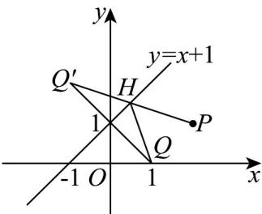
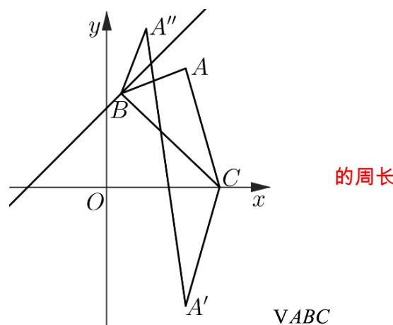

> [!faq]- 《专题07 直线交点坐标与各种距离全方位总结（九大题型）（高效培优期中专项训练）数学人教A版2019高二选择性必修第一册》官方解析
>
> > [!success]- **【答案】** A. $2\sqrt{2}$ B. $\sqrt{11}$ C. $\sqrt{10}$ D. 3
>
> > [!note]- **【分析】**
> > 利用对称性以及两点间的距离公式来求得正确答案
>
> > [!note]- **【解析】**
> > 设点 $Q(1,0)$ 关于直线x-y+1=0的对称点为 $Q'(a,b)$ ，
> > 则 $\left\{\begin{aligned}\frac{b}{a-1}&=-1\\ \frac{a+1}{2}&-\frac{b}{2}+1=0\end{aligned}\right.$ ，解得 $\left\{\begin{aligned}a&=-1\\ b&=2\end{aligned}\right.$
> >
> > 即 $Q(1,0)$ 关于 $x-y+1=0$ 的对称点为 $Q'(-1,2)$ ，且 $|HQ|=|HQ'|$ ，
> >
> > 
> >
> > 所以 $\left|HP\right|+\left|HQ\right|=\left|HP\right|+\left|HQ'\right|$ $\left|PQ'\right|=\sqrt{3^{2}+1^{2}}=\sqrt{10}$ ，当 $Q',H,P$ 三点共线时取等号，
> >
> > 故 BC 选项符合题意，
> >
> > 故选：BC
> >
> > 45. 三角形 $ABC$ 中，顶点 $A(2,3)$ ，点 $B$ 在直线 $x - y + 2 = 0$ 上，点 $C$ 在 $x$ 轴上，则三角形 $ABC$ 周长的最小值为 \_\_\_\_.
> >
> > 【答案】 $5 \sqrt{2}$
> >
> > 【分析】利用轴对称求得对称点，结合图象，可得答案·
> >
> > 【详解】由 $A(2,3)$ ，则其关于 $x$ 轴的对称点为 $A'(2,-3)$
> >
> > 设 $A$ 关于直线 $x - y + 2 = 0$ 的对称点为 $A''(a,b)$
> >
> > 则 $\left\{ \begin{array}{l} \frac{b - 3}{a - 2} \cdot 1 = -1 \\ \frac{a + 2}{2} - \frac{b + 3}{2} + 2 = 0 \end{array} \right.$ ，解得 $\left\{ \begin{array}{ll} a = 1 & \text{即} \\ b = 4 & A''(1,4) \end{array} \right.$
> >
> > 作图如下：
> >
> > 
> >
> > $$
> > \left| A B \right| + \left| A C \right| + \left| B C \right| = \left| A ^ {\prime \prime} B \right| + \left| A ^ {\prime} C \right| + \left| B C \right| \quad \left| A ^ {\prime} A ^ {\prime \prime} \right| = \sqrt {1 + 4 9} = 5 \sqrt {2}
> > $$
> >
> > 故答案为： $5\sqrt{2}$
