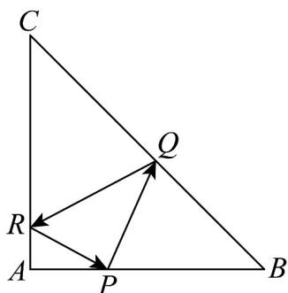
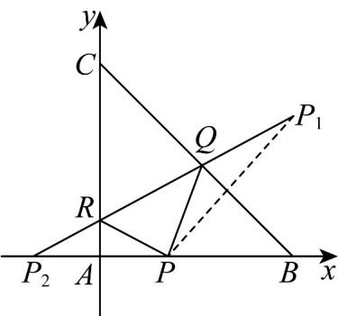

> [!faq]- 《专题07 直线交点坐标与各种距离全方位总结（九大题型）（高效培优期中专项训练）数学人教A版2019高二选择性必修第一册》官方解析
>
> > [!success]- **【答案】**  A. $\frac{16}{3}$ B. $4$ C. $5$ D. $\frac{15}{4}$
>
> > [!note]- **【分析】**
> > 建立直角坐标系，设点 P 的坐标，可得 P 关于直线 BC 的对称点 $P_{1}$ 的坐标，和 P 关于 y 轴的对称点 $P_{2}$ 的坐标，由 $P_{1}, Q, R, P_{2}$ 四点共线可得直线的方程，由于过三角形 ABC 的重心，代入可得关于 a 的方程，解得 P 的坐标，即可求得 PB 的长和直线方程，进而求得面积。
>
> > [!note]- **【解析】**
> > 
> >
> > 建立直角坐标系，可得 $B(6,0), C(0,6)$ ，故直线 $BC$ 的方程为 $x + y = 6$
> >
> > 则三角形 $ABC$ 的重心为 $\left(\frac{0+0+6}{3},\frac{0+0+6}{3}\right)$ ，即 $(2,2)$ ，
> >
> > 设 $P(a,0)$ ，其中 $0 < a < 6$ ，则点 $P$ 关于直线 $BC$ 的对称点 $P_{1}(x,y)$
> >
> > 满足 $\left\{ \begin{array}{l} \frac{a + x}{2} + \frac{0 + y}{2} = 6 \\ \frac{y - 0}{x - a} \times (-1) = -1 \end{array} \right.$ ，解得 $\left\{ \begin{array}{ll} x = 6 & \text{，即}\\ y = 6 - a & P_1(6,6 - a) \end{array} \right.$
> >
> > 易得 P 关于 y 轴的对称点 $P_{2}(-a,0)$ ，由光的反射原理可知 $P_{1}, Q, R, P_{2}$ 四点共线，
> >
> > 直线 $QR$ 的斜率为 $k = \frac{6 - a - 0}{6 - (-a)} = \frac{6 - a}{6 + a}$ ，故直线 $QR$ 的方程为 $y = \frac{6 - a}{6 + a} (x + a)$
> >
> > 由于直线 $QR$ 过三角形 $ABC$ 的重心 $(2,2)$ ，代入得 $2 = \frac{6 - a}{6 + a} (2 + a)$
> >
> > 化简得 a=2 或 a=0（舍去），故 $P(2,0)$ , $P_{1}(6,4)$ , $P_{2}(-2,0)$ , 直线 QR 的方程为 $y=\frac{1}{2}(x+2)$ ,
> >
> > 联立 $\left\{\begin{aligned}x+y&=6\\ y&=\frac{1}{2}(x+2)\end{aligned}\right.$ ，解得 $\left\{\begin{aligned}x&=\frac{10}{3}\\ y&=\frac{8}{3}\end{aligned}\right.$ ，即点 Q 的坐标为 $Q\left(\frac{10}{3},\frac{8}{3}\right)$ 。
> >
> > 则三角形 $PQB$ 的面积 $S = \frac{1}{2} \times (6 - 2) \times y_{Q} = 2 \times \frac{8}{3} = \frac{16}{3}$ ，
> >
> > 故选 **A**
>
> > [!tip]- **【名师点睛】**
> > 关键点点睛：根据题干设出点 P 的坐标，根据对称性和光的反射原理可知 $P_{1}, Q, R, P_{2}$ 四点共线，进而求出点 $P_{1}, P_{2}$ 的坐标，和直线 QR 的方程，进而求出点 Q 的坐标，即可求得结果.
