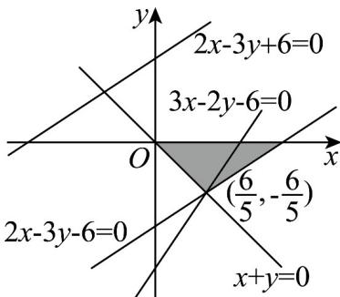

> [!faq]- 《专题07 直线交点坐标与各种距离全方位总结（九大题型）（高效培优期中专项训练）数学人教A版2019高二选择性必修第一册》官方解析
>
> > [!success]- **【答案】** AC
>
> > [!note]- **【分析】**
> > 通过联立方程组求得交点坐标，结合三角形的面积、对称性等知识对选项进行
> > 确答案：
>
> > [!note]- **【解析】**
> > 由 $\left\{\begin{aligned}x+y=0\\2x-3y-6=0\end{aligned}\right.$ 解得 $x=\frac{6}{5},y=-\frac{6}{5}$ ，所以交点坐标为 $\left(\frac{6}{5},-\frac{6}{5}\right)$ ，A 选项正确。
> > 直线 $l_{2}:2x-3y-6=0$ 与 x 轴的交点为 $(3,0)$ ，与 y 轴的交点为 $(0,-2)$ ，
> > 直线 $l_{1}$ 过原点，由图可知，直线 $l_{1}$ 、 $l_{2}$ 和 x 轴围成的三角形的面积为 $\frac{1}{2}\times3\times\frac{6}{5}=\frac{9}{5}$ ，
> > 所以 B 选项错误。
> > 由上述分析可知，直线 $l_{2}$ 关于原点 O 对称的直线过点 $(-3,0),(0,2)$ ，
> > 所以直线 $l_{2}$ 关于原点 O 对称的直线方程为 $y-2=\frac{2-0}{0-(-3)}(x-0),2x-3y+6=0$ ，
> > 所以 C 选项正确。
> > 点 $(3,0)$ 关于直线 x + y = 0 的对称点是 $(0,-3)$ ；
> > 点 $(0,-2)$ 关于直线 x + y = 0 的对称点是 $(2,0)$ ，
> > 所以直线 $l_{2}$ 关于直线 $l_{1}$ 对称的直线方程为 $\frac{x}{2}+\frac{y}{-3}=1$ ，
> > 即 3x-2y-6=0，所以 D 选项错误。
> > 故选：AC
> >
> > 
