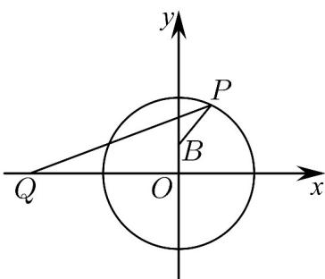

> [!faq]- 《专题08 圆的两类全方位总结（九大题型）（高效培优期中专项训练）数学人教A版2019高二选择性必修第一册》官方解析
>
> > [!success]- **【答案】** $\left(-\infty,\frac{\sqrt{17}}{2}\right]$
>
> > [!note]- **【分析】**
> > 首先利用三角函数化简已知，转化为 $f(\alpha) = \sqrt{(\cos\alpha + 2)^2 + \sin^2\alpha} - \sqrt{\cos^2\alpha + (\sin\alpha - \frac{1}{2})^2}$ ，利用两点间距离公式构造几何意义，求距离差的最大值，再根据存在问题求 $m$ 的取值范围·
>
> > [!note]- **【解析】**
> > 因为 $\sqrt{5 + 4\cos\alpha} -\sqrt{\cos^2\alpha + \left(\sin\alpha - \frac{1}{2}\right)^2} = \sqrt{\left(\cos\alpha + 2\right)^2 + \sin^2\alpha} -\sqrt{\cos^2\alpha + \left(\sin\alpha - \frac{1}{2}\right)^2}$
> >
> > 设 $P(\cos \alpha, \sin \alpha)$ ， $Q(-2, 0)$ ， $S\left(0, \frac{1}{2}\right)$ ，令 $f(\alpha) = \sqrt{(\cos \alpha + 2)^2 + \sin^2 \alpha} - \sqrt{\cos^2 \alpha + (\sin \alpha - \frac{1}{2})^2}$ ，
> >
> > $$
> > f (\alpha) = \sqrt {(\cos \alpha + 2) ^ {2} + \sin^ {2} \alpha} - \sqrt {\cos^ {2} \alpha + \left(\sin \alpha - \frac {1}{2}\right) ^ {2}} = | P Q | - | P B |
> > $$
> >
> > 又易知，点 $P(\cos \alpha, \sin \alpha)$ 在圆 $x^{2} + y^{2} = 1$ 上，如图所示，
> >
> > 
> >
> > 则 $\left|PQ\right|-\left|PB\right|\leq\left|QB\right|$ ，又 $\left|QB\right|=\sqrt{\left(0+2\right)^{2}+\left(\frac{1}{2}-0\right)^{2}}=\frac{\sqrt{17}}{2}$ ，故 $f(\alpha)$ 的最大值为 $\frac{\sqrt{17}}{2}$
> >
> > 因为存在实数 $\alpha\in R$ 使得 $\sqrt{5+4\cos\alpha}-\sqrt{\cos^{2}\alpha+(\sin\alpha-\frac{1}{2})^{2}}$ m
> >
> > 所以 $m \leq \left( \sqrt{5 + 4\cos\alpha} - \sqrt{\cos^2\alpha + (\sin\alpha - \frac{1}{2})^2} \right)_{\max}$ ，即 $m \leq \frac{\sqrt{17}}{2}$
> >
> > 故答案为： $\left(-\infty,\frac{\sqrt{17}}{2}\right]$
> >
> > 7. 过点 $A(-6,2)$ ， $B(2,-2)$ 且圆心在直线 $x-y+1=0$ 上的圆的方程是（）
> >
> > 【答案】
> > A. $(x-3)^{2}+(y-2)^{2}=25$ B. $(x+3)^{2}+(y+2)^{2}=25$ C. $(x-3)^{2}+(y-2)^{2}=5$ D. $(x+3)^{2}+(y+2)^{2}=5$
> >
> > 【答案】B
> >
> > 【分析】由题设得 $AB$ 的中垂线方程为 $y = 2(x + 2)$ ，其与 $x - y + 1 = 0$ 交点即为所求圆心，并应用两点距离公式求半径，写出圆的方程即可。
> >
> > 【详解】由题设， $AB$ 的中点坐标为 $(-2,0)$ ，且 $k_{AB} = \frac{-2 - 2}{2 - (-6)} = -\frac{1}{2}$
> >
> > ∴ AB 的中垂线方程为 $y = 2(x + 2)$ ，联立 $x - y + 1 = 0$
> >
> > $\therefore \left\{ \begin{array}{l} y = 2(x + 2) \\ x - y + 1 = 0 \end{array} \right.$ ，可得 $\left\{ \begin{array}{l} x = -3 \\ y = -2 \end{array} \right.$ ，即圆心为 $(-3, -2)$ ，而 $r = \sqrt{[2 - (-3)]^2 + [-2 - (-2)]^2} = 5$ ，
> >
> > ∴圆的方程是 $(x+3)^{2}+(y+2)^{2}=25$
> >
> > 故选：B.
> >
> > 8. “大漠孤烟直，长河落日圆”体现了我国古代劳动人民对于圆的认知·已知 $A(1,3), B(3,-1)$ ，则以 $AB$ 为直径的圆的方程为（ ）A. $(x - 2)^{2} + (y - 1)^{2} = 5$ B. $(x - 2)^{2} + (y - 1)^{2} = 20$ C. $(x + 1)^{2} + (y - 2)^{2} = 5$ D. $(x + 1)^{2} + (y - 2)^{2} = 20$
> >
> > 【答案】A
> >
> > 【分析】利用中点坐标公式，结合两点之间的距离公式，根据圆的标准方程，可得答案
> >
> > 【详解】由 $A(1,3), B(3,-1)$ ，则线段 $AB$ 的中点为 $(2,1)$ ，即圆的圆心为 $(2,1)$
> >
> > 圆的半径 $r = \sqrt{(2 - 1)^2 + (1 - 3)^2} = \sqrt{5}$
> >
> > 所以圆的方程为 $(x - 2)^{2} + (y - 1)^{2} = 5$
> >
> > 故选 **A**.
