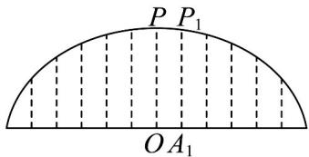
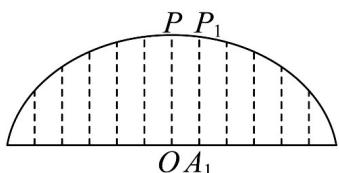
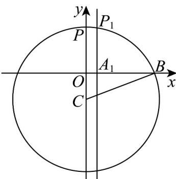

> [!faq]- 《专题08 圆的两类全方位总结（九大题型）（高效培优期中专项训练）数学人教A版2019高二选择性必修第一册》官方解析
>
> > [!success]- **【答案】**   A. $\sqrt{167} - 5\mathrm{m}$ B. $\sqrt{167} - 8\mathrm{m}$ C. $\sqrt{165} - 5\mathrm{m}$ D. $\sqrt{165} - 8\mathrm{m}$
>
> > [!note]- **【分析】**
> > 建立平面直角坐标系，写出圆的方程，根据 $A_{1}$ 的坐标即可求出 $A_{1}P_{1}$ 的长.
>
> > [!note]- **【解析】**
> > 以 O 为坐标原点， $OA_{1}$ 为 x 轴，OP 为 y 轴建立平面直角坐标系，如图，
> >
> > 设该圆拱梁所在圆的圆心为 C，则圆心在 y 轴上，由题知圆拱跨度的一半 OB = 12，设该圆半径为 r，则在 $Rt^{\triangle} OCB$ 中， $r^{2} = (r - 8)^{2} + 12^{2}$ ，解得：r = 13。
> >
> > 故圆的方程为 $x^{2} + (y + 5)^{2} = 169$
> >
> > 又桥面每隔2m有一个支柱，故 $A_{1}(2,0)$ ，
> >
> > 将 $x = 2$ 代入圆方程得： $2^{2} + (y + 5)^{2} = 169$ ，因为 $y > 0$
> >
> > 解得： $y = \sqrt{165} - 5$
> >
> > 所以支柱 $A_{1}P_{1}$ 的长为 $\sqrt{165} - 5$
> >
> > 故选：C.
> >
> > 
> >
> > 
> >
> > 
> >
> > ## 考点02 三点确定圆的方程
