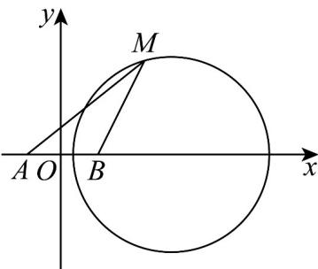

> [!faq]- 《专题08 圆的两类全方位总结（九大题型）（高效培优期中专项训练）数学人教A版2019高二选择性必修第一册》官方解析
>
> > [!success]- **【答案】** A
>
> > [!note]- **【分析】**
> > 求出点 M 的轨迹方程为圆 $(x-6)^{2}+y^{2}=32$ ，数形结合得 $\triangle MAB$ 高的最大值为圆的半径，可解问
> >
> > 题·
>
> > [!note]- **【解析】**
> > 设 $M(x,y)$ ，由 $\left|MA\right| = \sqrt{2}\left|MB\right|$
> >
> > 
> >
> > 得 $\left(x + 2\right)^2 +y^2 = 2\left(x - 2\right)^2 +2y^2$ ，化简整理得 $x^{2} + y^{2} - 12x + 4 = 0$
> >
> > 即点 M 的轨迹为圆 $(x-6)^{2}+y^{2}=32$ ，半径为 $r=4\sqrt{2}$
> >
> > 由于 $|\mathrm{AB}| = 4$ ，所以当 $AB$ 边上高最大时， $\triangle MAB$ 的面积最大，
> >
> > 所以 $S_{\vee MAB} \leq \frac{1}{2} |AB| \cdot r = \frac{1}{2} \times 4 \times 4\sqrt{2} = 8\sqrt{2}$ .
> >
> > 故选 **A**.
