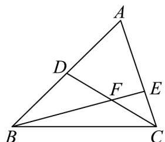
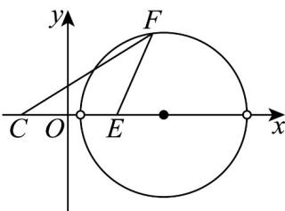

> [!faq]- 《专题08 圆的两类全方位总结（九大题型）（高效培优期中专项训练）数学人教A版2019高二选择性必修第一册》官方解析
>
> > [!success]- **【答案】** $12 \sqrt{3}$
>
> > [!note]- **【分析】**
> > 根据给定条件，利用平面向量共线向量定理的推论可得 $FE = \frac{\sqrt{3}}{3} FC$ ，再建立平面直角坐标系，求出点 $F$ 到边 $AC$ 的距离的最大值，利用倍分法求出面积最大值·
>
> > [!note]- **【解析】**
> > 在 $\forall ABC$ 中， $D$ 是 $AB$ 的中点， $E$ 在边 $AC$ 上， $AE = 2EC$
> >
> > $\overline{BE}=\overline{BC}+\overline{CE}=\overline{BC}+\frac{1}{3}\overline{CA}=\frac{1}{3}\overline{BA}+\frac{2}{3}\overline{BC}=\frac{2}{3}\overline{BD}+\frac{2}{3}\overline{BC}$ ，令 $\overline{BE}=\lambda\overline{BF}$ ，
> >
> > 则 $\overline{BF} = \frac{2}{3\lambda}\overline{BD} +\frac{2}{3\lambda}\overline{BC}$ ，又点 $C,F,D$ 共线，于是 $\frac{2}{3\lambda} +\frac{2}{3\lambda} = 1$ ，解得 $\lambda = \frac{4}{3}$
> >
> > 则 $FE = \frac{1}{3}FB = \frac{\sqrt{3}}{3}FC$ ，VABC 的面积 $S_{\triangle ABC} = 3S_{\triangle BCE} = 12S_{\triangle FCE}$ ，
> >
> > 
> >
> > 由 $AC = 6$ ，得 $CE = 2$ ，以直线 $CE$ 为 $x$ 轴，线段 $CE$ 的中垂线为 $y$ 轴建立平面直角坐标系，
> >
> > 点 $C(-1,0), E(1,0)$ ，设 $F(x,y)$ ，则 $3(x - 1)^2 + 3y^2 = (x + 1)^2 + y^2$
> >
> > 整理得 $(x - 2)^{2} + y^{2} = 3$ ，因此点 $F$ 的轨迹是以(2,0)为圆心， $\sqrt{3}$ 为半径的圆（除圆与 $x$ 轴的交点外），则点 F 到边 AC 的距离的最大值为 $\sqrt{3}$ ，
> > 所以 $\bigvee ABC$ 的面积的最大值为 $12 \times \frac{1}{2} \times 2 \times \sqrt{3} = 12\sqrt{3}$ .
> > 故答案为： $12\sqrt{3}$
> >
> > 
