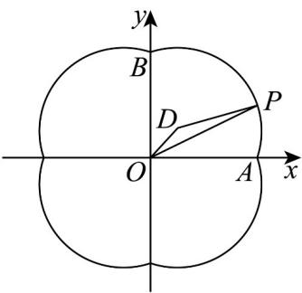
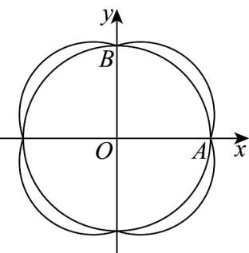
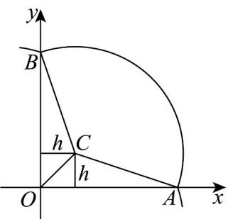

> [!faq]- 《专题08 圆的两类全方位总结（九大题型）（高效培优期中专项训练）数学人教A版2019高二选择性必修第一册》官方解析
>
> > [!success]- **【答案】** AB
>
> > [!note]- **【分析】**
> > 对于 $^{A}$ ，在曲线上取点，写出关于x轴对称的点，代入方程，可得答案；对于 $^{B}$ ，由题作图，结合三角形的三边关系结合圆的性质，可得答案；对于 $^{C}$ ，结合题意，将曲线M的中心对称为圆心C，利用数形结合，可得答案；对于 $^{D}$ ，根据曲线M在第一象限进行分割，利用面积之间的对比，可得答案。
>
> > [!note]- **【解析】**
> > 对于 A，任意取曲线 M 上的一点 $(x, y)$ ，即 $x^{2} + y^{2} = |x| + |y| + 2$
> >
> > 其关于 $x$ 轴的对称点 $(x, -y)$ ，则 $x^{2} + (-y)^{2} = |x| + |-y| + 2$ ，显然方程成立，
> >
> > 所以曲线 M 关于 x 轴对称，故 $\Lambda$ 正确；
> >
> > 对于 B，当 x 0, y 0 时，曲线方程为 $\left(x-\frac{1}{2}\right)^{2}+\left(y-\frac{1}{2}\right)^{2}=\frac{5}{2}$
> >
> > 则其圆心 $D\left(\frac{1}{2}, \frac{1}{2}\right)$ ，半径为 $r = \frac{\sqrt{10}}{2}$
> >
> > 与 $x$ 轴正半轴交点 $A(2,0)$ ，与 $y$ 轴正半轴交点 $B(0,2)$ 。
> >
> > 
> >
> > ，当共线时，等号成立，故 $^{B}$ 正确；
> >
> > $x^{2} + y^{2} = |OP|^{2}\leq \left(|OD| + r\right)^{2} = 3 + \sqrt{5}$ $O,D,P$
> >
> > 对于 $C$ ，由题意作图如下：
> >
> > 
> >
> > 当点 C 与点 O 重合时，以 OA 为半径的圆 C 为符合题意的最大面积，此时面积为 $4\pi$ ，故 C 错误；
> > 对于 D，由题意作图如下：
> >
> > 
> >
> > 曲线 M 所围成的图形在第一象限分为 $\triangle OCB$ 、 $\triangle OCA$ 与扇形 ACB，
> >
> > 易知 $S_{\triangle OCA} = S_{\triangle OCB} = \frac{1}{2}\times 2\times \frac{1}{2} = \frac{1}{2}$
> >
> > 扇形 $_{ACB}$ 的面积小于圆 $_{C}$ 的一半 $\frac{1}{2}\times\left(\frac{\sqrt{10}}{2}\right)^{2}\pi=\frac{5}{4}\pi$
> >
> > 由曲线 $M: x^{2} + y^{2} = |x| + |y| + 2$ ，则曲线 M 关于 x, y 轴成轴对称，
> >
> > 曲线 $M$ 围成的图形的面积小于 $4\left(\frac{1}{2} + \frac{1}{2} + \frac{5}{4}\pi\right) = 4 + 5\pi$ ，故D错误.
> >
> > 故选 **AB**.
