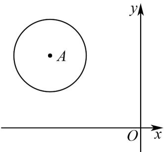

> [!faq]- 《专题08 圆的两类全方位总结（九大题型）（高效培优期中专项训练）数学人教A版2019高二选择性必修第一册》官方解析
>
> > [!success]- **【答案】** C
>
> > [!note]- **【分析】**
> > 化简圆的表达式，得出圆心坐标和半径，利用所有点都在第二象限，即可得出 $a$ 的取值范围·
>
> > [!note]- **【解析】**
> > 由题意，
> >
> > 在圆 $x^{2} + y^{2} - 2ax + 4ay + 5a^{2} - 9 = 0$ 中， $(x - a)^{2} + (y + 2a)^{2} = 9$
> >
> > ∴圆心坐标为 $(a,-2a)$ ，半径为3.
> >
> > 
> >
> > ∵圆上所有点都在第二象限，
> >
> > $\therefore \left\{ \begin{array}{l}a <   0\\ -2a > 0\\ a + 3 <   0\\ -2a - 3 > 0 \end{array} \right.$ ，解得 $a <   - 3$
> >
> > 故选 **C**.
