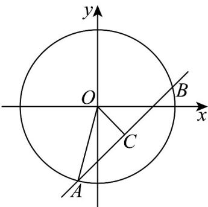

> [!faq]- 《专题09 直线与圆及圆与圆的位置关系全方位总结（九大题型）（高效培优期中专项训练）数学人教A版2019高二选择性必修第一册》官方解析
>
> > [!success]- **【答案】** B
>
> > [!note]- **【分析】**
> > 作出图象，求出 OC 和 AC 的长，利用勾股定理即可求出 a 的值·
>
> > [!note]- **【解析】**
> > 由题意，
> >
> > 在 $y = x - \sqrt{2}$ 中， $x - y - \sqrt{2} = 0$
> >
> > 在 $O: x^{2} + y^{2} = a^{2}$ 中， $O(0,0)$ ，半径为 $a(a > 0)$
> >
> > 直线与圆相交于 $A, B$ 两点，且 $\left|AB\right| = 2\sqrt{3}$
> >
> > 设 AB 中点为 C，连接 OA，OC，
> >
> > 
> >
> > 由几何知识得， $OC\perp AB$ ， $AC = BC = \frac{1}{2} AB = \sqrt{3}$
> >
> > 在 Rt 中， $OA = |a|$ ， $OC = \frac{|0 - 0 - \sqrt{2}|}{\sqrt{1^2 + (-1)^2}} = 1$
> >
> > 由勾股定理得， $OA^2 = AC^2 + OC^2$ ，即 $a^2 = 1^2 + \left(\sqrt{3}\right)^2$ ，解得 $a = \pm 2$
> >
> > 故选 **B**.
