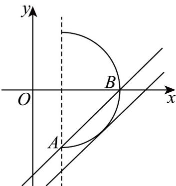

> [!faq]- 《专题09 直线与圆及圆与圆的位置关系全方位总结（九大题型）（高效培优期中专项训练）数学人教A版2019高二选择性必修第一册》官方解析
>
> > [!success]- **【答案】** $(-2\sqrt{2}-1,-3]$
>
> > [!note]- **【分析】**
> > 画出图象，数形结合，求出直线与半圆恰好相切时 $b$ 的值，再求出临界值，即可得解
>
> > [!note]- **【解析】**
> > 由 $x = 1 + \sqrt{4 - y^2}$ ，则 $x = 1$ ，且 $(x - 1)^2 +y^2 = 4$
> >
> > 所以 $x = 1 + \sqrt{4 - y^2}$ 表示以 $(1,0)$ 为圆心，2为半径的圆在 $x = 1$ 及直线 $x = 1$ 右侧部分，
> >
> > 直线 $y = x + b$ 是与 y = x 平行的直线，
> >
> > 如图所示：
> >
> > 
> >
> > 当直线 $y = x + b$ 与曲线相切时 $d = \frac{|1 - 0 + b|}{\sqrt{1^2 + (-1)^2}} = 2$ ，则 $b = -1 - 2\sqrt{2}$ （正值舍去），
> >
> > 当直线过点 $A(1, -2)$ 时， $b = -3$ ，结合图形分析得 $b$ 的取值范围是 $\left(-2\sqrt{2} - 1, -3\right]$ .
> >
> > 故答案为： $(-2\sqrt{2}-1,-3]$ .
