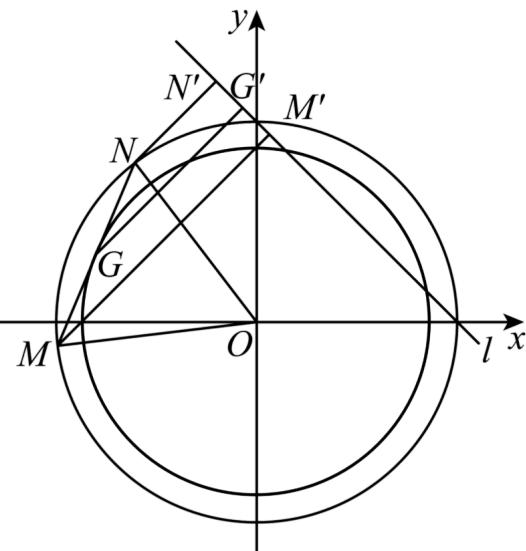

> [!faq]- 《专题09 直线与圆及圆与圆的位置关系全方位总结（九大题型）（高效培优期中专项训练）数学人教A版2019高二选择性必修第一册》官方解析
>
> > [!success]- **【答案】** $\sqrt{3} +\sqrt{2} /\sqrt{2} +\sqrt{3}$
>
> > [!note]- **【分析】**
> > 设圆 $O: x^{2} + y^{2} = 1$ ，直线 $l: x + y - 1 = 0$ ， $M(x_{1}, y_{1})$ ， $N(x_{2}, y_{2})$ ，求出 $\angle MON$ 的大小，求出 MN 中点的轨迹方程， $\frac{|x_{1} + y_{1} - 1|}{\sqrt{2}} + \frac{|x_{2} + y_{2} - 1|}{\sqrt{2}}$ 表示 M 和 N 到直线 $l: x + y - 1 = 0$ 的距离和，数形结合即可求出其最大值．
>
> > [!note]- **【解析】**
> > 设圆 $O: x^{2} + y^{2} = 1$ ，直线 $l: x + y - 1 = 0$ ， $M(x_{1}, y_{1})$ ， $N(x_{2}, y_{2})$ ，
> >
> > 则 $M(x_{1},y_{1})$ ， $N(x_{2},y_{2})$ 都在圆 $x^{2}+y^{2}=1$ 上，
> >
> > $$
> > \because | M N | = \sqrt {\left(x _ {1} - x _ {2}\right) ^ {2} + \left(y _ {1} - y _ {2}\right) ^ {2}} = \sqrt {x _ {1} ^ {2} + x _ {2} ^ {2} - 2 x _ {1} x _ {2} + y _ {1} ^ {2} + y _ {2} ^ {2} - 2 y _ {1} y _ {2}} = 1
> > $$
> >
> > $$
> > \left| O M \right| = \left| O N \right| = 1
> > $$
> >
> > $\therefore \triangle MON$ 是等边三角形， $\therefore \angle MON = 60^{\circ}$
> >
> > 过 M 和 N 作直线 $l: x + y - 1 = 0$ 的垂线，垂足分别为 $M', N'$
> >
> > 则 $\frac{|x_1 + y_1 - 1|}{\sqrt{2}} +\frac{|x_2 + y_2 - 1|}{\sqrt{2}}$ 表示 $M$ 和 $N$ 到直线 $l:x + y - 1 = 0$ 的距离和 $|MM^{\prime}| + |NN^{\prime}|$
> >
> > 
> >
> > 由图形得只有当 M 、 N 都在直线 l 的下方时，该距离之和才会取得最大值。
> >
> > 取 $MN$ 的中点 $G$ ，过 $G$ 作 $GG^{\prime} \perp l$ ，垂足为 $G^{\prime}$ ，则 $\left|MM^{\prime}\right| + \left|NN^{\prime}\right| = 2\left|GG^{\prime}\right|$
> >
> > ∵△MON 为等边三角形，G 为 MN 的中点，∴ $|OG|=\frac{\sqrt{3}}{2}$
> >
> > 则 $G$ 在圆 $x^{2} + y^{2} = \frac{3}{4}$ 上运动，
> >
> > 又 O 到直线 $x + y - 1 = 0$ 的距离为 $\frac{\sqrt{2}}{2}$ ，
> >
> > 则当 $MN / / l$ 时， $G$ 到直线 $x + y - 1 = 0$ 距离的最大值为 $\frac{\sqrt{3}}{2} + \frac{\sqrt{2}}{2}$ ，
> >
> > ∴ $\left|MM^{\prime}\right|+\left|NN^{\prime}\right|=2\left|GG^{\prime}\right|$ 的最大值为 $2\times\left(\frac{\sqrt{3}}{2}+\frac{\sqrt{2}}{2}\right)=\sqrt{3}+\sqrt{2}$
> >
> > 即 $\frac{|x_1 + y_1 - 1|}{\sqrt{2}} +\frac{|x_2 + y_2 - 1|}{\sqrt{2}}$ 的最大值为 $\sqrt{3} +\sqrt{2}$
> >
> > 故答案为： $\sqrt{3} +\sqrt{2}$
