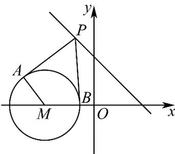

> [!faq]- 《专题09 直线与圆及圆与圆的位置关系全方位总结（九大题型）（高效培优期中专项训练）数学人教A版2019高二选择性必修第一册》官方解析
>
> > [!success]- **【答案】** A. $2\sqrt{3}$ B. $\sqrt{3}$ C. 4 D. 2
>
> > [!note]- **【分析】**
> > 由圆的方程可确定圆心和半径，根据切线长与圆心到定点距离 $d$ 和半径 $r$ 之间关系，即切线长 $= \sqrt{d^2 - r^2}$ 可知当 $PM\perp l$ 时， $\left|PA\right|$ 最小，可确定四边形面积的最小值·
>
> > [!note]- **【解析】**
> > 由圆的方程知：圆心 $M(-2,0)$ ，半径 $r = \sqrt{2}$
> >
> > 
> >
> > 四边形 $PAMB$ 的面积 $S = 2S_{\triangle PAM} = 2 \times \frac{1}{2} |PA| \cdot r = \sqrt{2} |PA|$ ，
> >
> > 则当 $|PA|$ 最小时，四边形PAMB的面积最小，
> >
> > 点 $M$ 到直线 $l$ 的距离 $d = \frac{|-2 + 0 - 2|}{\sqrt{2}} = 2\sqrt{2}$
> >
> > $\therefore \left|PA\right|_{\min} = \sqrt{d^2 - r^2} = \sqrt{6}$
> >
> > 此时 $S_{\mathrm{min}} = 2\sqrt{3}$
> >
> > 故选 **A**
