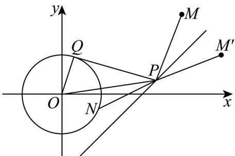
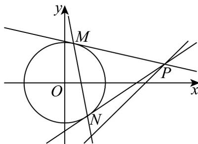

> [!faq]- 《专题09 直线与圆及圆与圆的位置关系全方位总结（九大题型）（高效培优期中专项训练）数学人教A版2019高二选择性必修第一册》官方解析
>
> > [!success]- **【答案】** BCD
>
> > [!note]- **【分析】**
> > 首先判断直线与圆的位置关系，再求圆心到直线距离得 $d-r=\sqrt{2}-1<\frac{1}{2}$ 判断 $^{A}$ ；由 $M,M'$ 关于x-y-2=0对称，得到 $\left|PM\right|+\left|PN\right|\quad\left|PM'\right|+\left|OP\right|-r\quad\left|OM'\right|-r$ ，即可求最值，注意取值条件判断 $^{B}$ ；由 $\angle OPQ$ 最大时，只需 $|OP|=d=\sqrt{2}$ ，进而确定 $\angle OPQ$ 的范围判断 $^{C}$ ；令 $P(x_{0},y_{0}),M(x_{1},y_{1}),N(x_{2},y_{2})$ ，得到M,N都在直线 $x_{0}x+y_{0}y=1$ 上，结合 $x_{0}-y_{0}-2=0$ 求定点判断D.
>
> > [!note]- **【解析】**
> > 由 $x^{2} + y^{2} = 1$ 的圆心 $C(0,0)$ ，半径 $r = 1$ ，
> >
> > 则 $C(0,0)$ 到 $x - y - 2 = 0$ 的距离为 $d = \frac{2}{\sqrt{2}} = \sqrt{2} > r$ ，即直线与圆相离，
> >
> > $$
> > d - r = \sqrt {2} - 1 <   \frac {1}{2}
> > $$
> >
> > $$
> > \frac {1}{2}
> > $$
> >
> > 由 关于 对称，则 $\left\{\begin{aligned}\frac{n-2}{m-3}&=-1\\\frac{m+3}{2}&-\frac{n+2}{2}-2=0\end{aligned}\right.$ ，可得 $\left\{\begin{aligned}m=4\\n=1\end{aligned}\right.$
> >
> > 由 $|PM|=|PM'|$ ，故 $\left|PM\right|+\left|PN\right|=\left|PM'\right|+\left|PN\right|$ ，
> >
> > 又 $|PN| \mid OP|-r$ ，则 $\left|PM\right|+\left|PN\right|\quad\left|PM'\right|+\left|OP\right|-r \quad\left|OM'\right|-r=\sqrt{17}-1$
> >
> > 当且仅当 $O, P, M'$ 三点共线时取等号，故 $\left|PM\right| + \left|PN\right|$ 的最小值为 $\sqrt{17} - 1$ ，B对；
> >
> > 由 $\angle OPQ$ 最大时，只需 $|OP| = d = \sqrt{2}$ ，此时 $\cos \angle OPQ = \frac{\sqrt{2}}{2}$ ，即 $(\angle OPQ)_{\max} = \frac{\pi}{4}$
> >
> > 所以 $\angle OPQ\in (0,\frac{\pi}{4} ]$ ，则 $\angle OPQ$ 可以为 $\frac{\pi}{6}$ ，即可以为为 $30^{\circ}$ ，C对；
> >
> > 
> >
> > 如下图，令 $P(x_0,y_0),M(x_1,y_1),N(x_2,y_2)$ ，则 $PM:x_{1}x + y_{1}y = 1$
> >
> > 由 $P$ 在切线上，则 $x_{1}x_{0} + y_{1}y_{0} = 1$ ，同理 $x_{2}x_{0} + y_{2}y_{0} = 1$
> >
> > 显然 $M(x_{1},y_{1}), N(x_{2},y_{2})$ 都在直线 $x_{0}x + y_{0}y = 1$ 上，又 $x_{0} - y_{0} - 2 = 0$
> >
> > 所以 $x_0 x + (x_0 - 2)y = 1$ ，即 $x_0(x + y) - 2y - 1 = 0$ ，易知直线恒过点 $\left(\frac{1}{2}, -\frac{1}{2}\right)$ ，D 对·
> >
> > 
> >
> > 故选 **BCD**
