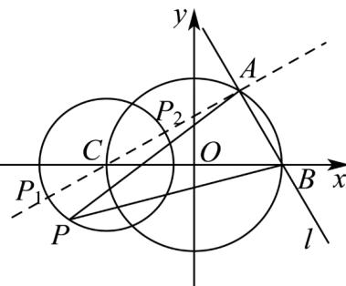

> [!faq]- 《专题09 直线与圆及圆与圆的位置关系全方位总结（九大题型）（高效培优期中专项训练）数学人教A版2019高二选择性必修第一册》官方解析
>
> > [!success]- **【答案】** A
>
> > [!note]- **【分析】**
> > 先求出弦长 $|AB|$ ，结合图形，推得 $\triangle PAB$ 的面积的取值范围即点P到直线l的距离的范围，因动点P在圆 $C:(x+2)^{2}+y^{2}=r^{2}(r>0)$ 上运动，故得点P到直线l的距离的范围即 $\left[2\sqrt{3}-r,2\sqrt{3}+r\right]$ ，根据题意即得·
>
> > [!note]- **【解析】**
> > 
> >
> > 如图，圆 $O: x^2 + y^2 = 4$ 的圆心 $O$ 到直线 $l: \sqrt{3} x + y - 2\sqrt{3} = 0$ 的距离为 $d_1 = \frac{|-2\sqrt{3}|}{2} = \sqrt{3}$
> >
> > 故弦 $|AB|=2\sqrt{2^{2}-(\sqrt{3})^{2}}=2$ ，记点P到直线l的距离为 $h_{P-l}$ ，
> >
> > 则 $\triangle PAB$ 的面积 $S_{\triangle PAB} = \frac{1}{2}|AB|h_{P - l} = h_{P - l}$ ，其范围即 $h_{P - l}$ 的范围·
> >
> > 由图知·当点 P 为过点 C 且与直线 l 垂直的直线与圆 C 的交点时， $h_{P-l}$ 取到最大和最小（即图中的点 $P_{1}, P_{2}$ ）
> > 因圆心 C 到直线 l 的距离为 $d = \frac{\left| -2\sqrt{3} - 2\sqrt{3} \right|}{2} = 2\sqrt{3}$ ，故 $h_{P-l}$ 的取值范围为 $\left[ 2\sqrt{3} - r, 2\sqrt{3} + r \right]$ ，
> >
> > 则 $\triangle PAB$ 的面积的取值范围为 $\left[2\sqrt{3} - r, 2\sqrt{3} + r\right]$ ，故 $r = \sqrt{3}$
> >
> > 故选 **A**.
