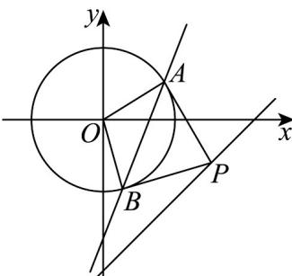

> [!faq]- 《专题09 直线与圆及圆与圆的位置关系全方位总结（九大题型）（高效培优期中专项训练）数学人教A版2019高二选择性必修第一册》官方解析
>
> > [!success]- **【答案】** ABD
>
> > [!note]- **【分析】**
> > 由勾股定理得当 $|OP|$ 最小时， $|AP|$ 最小，计算可判断 $^{A}$ 选项；由题意可得 $|PA|$ 最小时，四边形PAOB的面积最小，计算可判断 $^{B}$ 选项；当 $|AP|$ 最小时， $\angle APB$ 最大， $\tan\angle APO<1$ ，可判断 $^{C}$ 选项；根据PA,PB与圆O相切，得到直线AB的方程，从而求得定点可判断 $^{D}$ 选项.
>
> > [!note]- **【解析】**
> > 如图所示，
> >
> > 
> >
> > 对于选项 A，因为 $\left|AP\right|=\sqrt{\left|OP\right|^{2}-\left|OA\right|^{2}}$ ，所以当 $\left|OP\right|$ 最小时， $\left|AP\right|$ 最小，
> >
> > 而 $O(0,0), l: x - y - 3 = 0$ ，则 $|OP|_{\min} = \frac{|-3|}{\sqrt{2}} = \frac{3\sqrt{2}}{2}$
> >
> > 此时 $\left|AP\right|_{\min}=\sqrt{\left(\frac{3\sqrt{2}}{2}\right)^{2}-(\sqrt{2})^{2}}=\frac{\sqrt{10}}{2}$ ，正确；
> >
> > 对于选项 B，因为 $S_{PAOB} = 2 \times S_{\triangle PAO} = 2 \times \frac{1}{2} |PA| \cdot |AO| = |PA| \cdot |AO| = \sqrt{2} |PA|$
> >
> > 所以 $|PA|$ 最小时，四边形PAOB的面积最小，且为 $\frac{\sqrt{10}}{2}\times\sqrt{2}=\sqrt{5}$ ，正确；
> >
> > 对于选项 C，当 $\left|AP\right|$ 最小时， $\angle APB$ 最大，而此时 $\tan\angle APO=\frac{\left|AO\right|}{\left|AP\right|}<1,\angle APB$ 是锐角，
> >
> > 所以不存在点 P 使四边形 PAOB 是正方形，错误；
> >
> > 对于选项D，圆 $O:x^{2} + y^{2} = 2$ 的圆心为 $O(0,0)$ ，半径为 $\sqrt{2}$ .设 $P(x_0,y_0)$
> >
> > 因为 P 在直线 $l: y = x - 3$ 上，所以 $y_{0} = x_{0} - 3$
> >
> > 又 $PA, PB$ 为圆 $O$ 的切线，故以 $OP$ 为直径的圆的方程为 $x(x - x_0) + y(y - y_0) = 0$
> >
> > 联立 $\left\{ \begin{array}{l}x(x - x_0) + y(y - y_0) = 0\\ x^2 +y^2 = 2 \end{array} \right.$ ，两式作差可得直线 $AB$ 的方程为 $l_{AB}:x_0x + y_0y = 2$
> >
> > 将 $y_{0}=x_{0}-3$ 代入得 $l_{AB}:x_{0}x+(x_{0}-3)y=2$ ，即 $l_{AB}:(x+y)x_{0}-3y-2=0$
> >
> > 所以直线 $AB$ 恒过定点 $\left(\frac{2}{3}, -\frac{2}{3}\right)$ ，正确。
> >
> > 故选 **ABD**.
