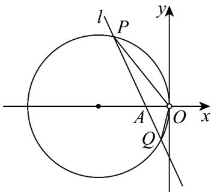

> [!faq]- 《专题09 直线与圆及圆与圆的位置关系全方位总结（九大题型）（高效培优期中专项训练）数学人教A版2019高二选择性必修第一册》官方解析
>
> > [!success]- **【答案】** (1) $x^{2}+y^{2}+12x=0(y\neq0)$ (2)定值，-5
>
> > [!note]- **【分析】**
> > （1）设 $C(x,y)(y \neq 0)$ ，结合题设列出方程即可求解；
> >
> > (2) 设 $l: x = my - 2$ ， $P(x_1, y_1)$ ， $Q(x_2, y_2)$ ，联立直线与曲线 $W$ 的方程，结合韦达定理求得 $x_1x_2, y_1y_2$ ，进而求解即可·
>
> > [!note]- **【解析】**
> > （1）设 $C(x,y)(y\neq 0)$ ，因为 $3|CA| = 2|CB|$ ，即 $9|CA|^2 = 4|CB|^2$
> >
> > 所以 $9(x+2)^{2}+9y^{2}=4(x-3)^{2}+4y^{2}$
> >
> > 整理得 $x^{2} + y^{2} + 12x = 0$
> >
> > 所以曲线 W 的方程为 $x^{2} + y^{2} + 12x = 0 (y \neq 0)$ .
> >
> > (2) 设 $l: x = my - 2$ ， $P(x_1, y_1)$ ， $Q(x_2, y_2)$ .
> >
> > 联立方程组 $\left\{\begin{aligned}x&=my-2,\\ x^{2}&+y^{2}+12x=0,\end{aligned}\right.$ 得 $\left(m^{2}+1\right)y^{2}+8my-20=0$
> >
> > 所以 $\Delta = 64m^{2} + 80(m^{2} + 1) > 0$
> >
> > 则 $y_{1} + y_{2} = -\frac{8m}{m^{2} + 1}$ ， $y_{1}y_{2} = -\frac{20}{m^{2} + 1}$ ，
> >
> > 因为 $x_{1}x_{2} = (my_{1} - 2)(my_{2} - 2) = m^{2}y_{1}y_{2} - 2m(y_{1} + y_{2}) + 4$
> >
> > $$
> > = \frac {- 2 0 m ^ {2}}{m ^ {2} + 1} + \frac {1 6 m ^ {2}}{m ^ {2} + 1} + 4 = \frac {4}{m ^ {2} + 1}
> > $$
> >
> > 所以 $k_{OP} \cdot k_{OQ} = \frac{y_{1}}{x_{1}} \cdot \frac{y_{2}}{x_{2}} = \frac{y_{1} y_{2}}{x_{1} x_{2}} = -5$
> >
> > 故直线 OP，OQ 的斜率之积为定值，且定值为 -5。
> >
> > 
