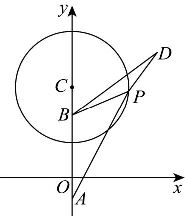

> [!faq]- 《专题09 直线与圆及圆与圆的位置关系全方位总结（九大题型）（高效培优期中专项训练）数学人教A版2019高二选择性必修第一册》官方解析
>
> > [!success]- **【答案】** (1) $x^{2}+\left(y-\frac{13}{3}\right)^{2}=\frac{64}{9}$ (2)存在， $B(0,3)$
>
> > [!note]- **【分析】**
> > （ $^{1}$ ）根据直线与圆相切，可求圆心，可得方程；
> >
> > (2) 假设存在定点 $B$ ，设 $B(0, m) (m \neq -1)$ ，表示 $\frac{|PB|}{|PA|}$ ，讨论是否存在定值；
>
> > [!note]- **【解析】**
> > （1）由题意设圆心坐标为 $(0,b)(b > 0)$ ，则圆 $C$ 的方程为 $x^{2} + (y - b)^{2} = \frac{64}{9} (b > 0)$
> >
> > 因为直线 12x-9y-1=0 与圆 C 相切，
> >
> > 所以点 $C(0,b)$ 到直线 $l:12x - 9y - 1 = 0$ 的距离 $d = \frac{|-9b - 1|}{\sqrt{12^2 + (-9)^2}} = \frac{8}{3}$
> >
> > 因为 b > 0 ，所以 $b = \frac{13}{3}$ ，
> >
> > 故圆 $C$ 的标准方程为 $x^{2} + \left(y - \frac{13}{3}\right)^{2} = \frac{64}{9}$
> >
> > (2)
> >
> > 
> >
> > 假设存在定点 $B$ ，设 $B(0,m)(m \neq -1)$
> >
> > 设 $P(x,y)$ ，则 $x^{2} = \frac{64}{9} -\left(y - \frac{13}{3}\right)^{2} = -y^{2} + \frac{26}{3} y - \frac{35}{3}$
> >
> > $$
> > \frac {| P B |}{| P A |} = \frac {\sqrt {x ^ {2} + (y - m) ^ {2}}}{\sqrt {x ^ {2} + (y + 1) ^ {2}}} = \frac {\sqrt {- y ^ {2} + \frac {2 6}{3} y - \frac {3 5}{3} + (y - m) ^ {2}}}{\sqrt {- y ^ {2} + \frac {2 6}{3} y - \frac {3 5}{3} + (y + 1) ^ {2}}} = \sqrt {\frac {m ^ {2} - \frac {3 5}{3} + (\frac {2 6}{3} - 2 m) y}{- \frac {3 2}{3} + \frac {3 2}{3} y}}
> > $$
> >
> > 当 $\frac{m^2 - \frac{35}{3}}{-\frac{32}{3}} = \frac{\frac{26}{3} - 2m}{\frac{32}{3}} >0$ ，即 $m = 3$ ，（舍去）时， $\frac{|PB|}{|PA|}$ 为定值，且定值为 $\frac{1}{2}$ ，
> >
> > 故存在定点 $_{B}$ 使得 $\frac{|PB|}{|PA|}$ 为定值， $_{B}$ 的坐标为 $(0,3)$ .
