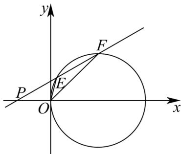

> [!faq]- 《专题09 直线与圆及圆与圆的位置关系全方位总结（九大题型）（高效培优期中专项训练）数学人教A版2019高二选择性必修第一册》官方解析
>
> > [!success]- **【答案】** (1) $(x-2)^{2}+y^{2}=4$ (2) (i) $\left(-\frac{2\sqrt{5}}{5}, 0\right) \cup \left(0, \frac{2\sqrt{5}}{5}\right)$ ; (ii) $k_{1}k_{2}=5$ ，详见解析
>
> > [!note]- **【分析】**
> > （1）设 $A(x,y)$ ， $M(x_0,y_0)$ ，利用相关点法即可求出轨迹方程；
> >
> > (2) 设直线 l 的方程为 $y = k(x + 1)(k \neq 0)$ ， $E(x_{1}, y_{1})$ ， $F(x_{2}, y_{2})$ ，联立直线 l 和曲线 C 的方程，消去 y 后，
> > (i) 由 $\Delta > 0$ 可求出斜率的取值范围；(ii) 利用斜率公式及韦达定理可求出 $k_{1}k_{2}$
>
> > [!note]- **【解析】**
> > （1）设 $A(x,y)$ ， $M(x_0,y_0)$ ，由中点坐标公式得 $\left\{ \begin{array}{l}x_0 = \frac{x + 6}{2}\\ y_0 = \frac{y + 4}{2} \end{array} \right.$
> >
> > 因为点 $M$ 为圆 $(x - 4)^2 +(y - 2)^2 = 1$ 上动点，所以 $(x_0 - 4)^2 +(y_0 - 2)^2 = 1$
> >
> > 所以 $\left(\frac{x+6}{2}-4\right)^{2}+\left(\frac{y+4}{2}-2\right)^{2}=1$ ，
> >
> > 整理得曲线 C 的方程为 $(x-2)^{2}+y^{2}=4$ .
> >
> > (2) (i) 设直线 $l$ 的方程为 $y = k(x + 1)(k \neq 0)$ , $E(x_1, y_1)$ , $F(x_2, y_2)$
> >
> > 联立 $\left\{ \begin{array}{l} y = kx + k \\ (x - 2)^2 + y^2 = 4 \end{array} \right.$ ，消去 $y$ 得： $\left(1 + k^2\right)x^2 + \left(2k^2 - 4\right)x + k^2 = 0$ ，
> >
> > 所以 $\Delta=\left(2k^{2}-4\right)^{2}-4k^{2}(1+k^{2})=4(4-5k^{2})>0$
> >
> > 解得 $-\frac{2\sqrt{5}}{5} < k < \frac{2\sqrt{5}}{5}$ ，又 $k \neq 0$ ，
> >
> > 所以直线 $l$ 斜率的取值范围为 $\left(-\frac{2\sqrt{5}}{5},0\right)\cup \left(0,\frac{2\sqrt{5}}{5}\right)$
> >
> > (ii) 由 (i) 知， $x_{1} + x_{2} = \frac{4 - 2k^{2}}{1 + k^{2}}$ ， $x_{1}x_{2} = \frac{k^{2}}{1 + k^{2}}$
> >
> > $$
> > k _ {1} k _ {2} = \frac {y _ {1}}{x _ {1}} \cdot \frac {y _ {2}}{x _ {2}} = \frac {k ^ {2} (x _ {1} + 1) (x _ {2} + 1)}{x _ {1} x _ {2}} = k ^ {2} \cdot \frac {x _ {1} x _ {2} + x _ {1} + x _ {2} + 1}{x _ {1} x _ {2}}
> > $$
> >
> > $$
> > = k ^ {2} \cdot \frac {\frac {k ^ {2}}{1 + k ^ {2}} + \frac {4 - 2 k ^ {2}}{1 + k ^ {2}} + 1}{\frac {k ^ {2}}{1 + k ^ {2}}} = k ^ {2} \cdot \frac {5}{k ^ {2}} = 5
> > $$
> >
> > 所以 $k_{1}k_{2}$ 是定值 5.
> >
> > 
