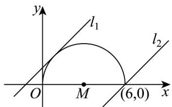

> [!faq]- 《专题09 直线与圆及圆与圆的位置关系全方位总结（九大题型）（高效培优期中专项训练）数学人教A版2019高二选择性必修第一册》官方解析
>
> > [!success]- **【答案】** AC
>
> > [!note]- **【分析】**
> > 由方程知曲线为半圆，再由题意转化为半圆夹在两平行直线之间，求出相切与过端点的情况即可得解.
>
> > [!note]- **【解析】**
> > 
> >
> > 由曲线 $y = \sqrt{6x - x^{2}}$ ，得 y = 0，则 $(x - 3)^{2} + y^{2} = 9$ （y = 0），
> >
> > 所以曲线 $y = \sqrt{6x - x^{2}}$ 表示以 $M(3,0)$ 为圆心，半径 r = 3 的半圆（x 轴及以上部分）.
> >
> > 若 $\left|x-y+m\right|+\left|x-y+n\right|$ 的值与x,y无关，
> >
> > 则该曲线在两平行直线 $l_{1}$ ： $x-y+m=0$ 与 $l_{2}$ ： $x-y+n=0$ 之间.
> >
> > 当 $l_{1}$ 与该曲线相切时， $\frac{3 + m}{\sqrt{2}} = 3$ ，解得 $m = 3\sqrt{2} -3$
> >
> > 则 $m$ 的取值范围为 $\left[3\sqrt{2} - 3, +\infty\right)$ .
> >
> > 当 $l_{2}$ 经过点 $(6,0)$ 时， $6+n=0$ ，解得 n=-6，则 n 的取值范围为 $(-∞,-6]$ .
> >
> > 故选 **AC**
