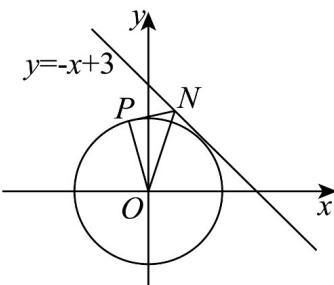
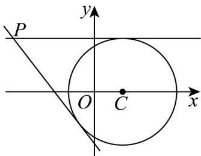
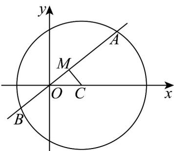
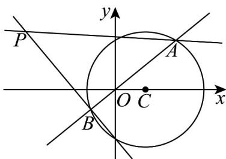

> [!faq]- 《专题09 直线与圆及圆与圆的位置关系全方位总结（九大题型）（高效培优期中专项训练）数学人教A版2019高二选择性必修第一册》官方解析
>
> > [!success]- **【答案】** (1) $r = 2$ (2) $\left[\frac{9-\sqrt{15}}{6},\frac{9+\sqrt{15}}{6}\right]$ (3)过定点，定点为 $O(0,0)$
>
> > [!note]- **【分析】**
> > （ $^{1}$ ）根据相切结合点到直线的距离公式运算求解即可；
> >
> > (2) 分析可知当 $NP$ 与圆 $O$ 相切（ $P$ 为切点）时， $\angle ONP$ 取到最大值，可得 $\left|ON\right| \leq \frac{4}{\sqrt{3}}$ ，运算求解即可；
> >
> > (3) 当且仅当 BC 是圆 O 的直径时，条件成立，即可得定点·
>
> > [!note]- **【解析】**
> > （1）由题意可知：圆 $O$ 的圆心为 $O(0,0)$ ，半径为 $r$ ，
> >
> > 因为圆心 $O$ 与直线 $x + 2y - 2\sqrt{5} = 0$ 相切，所以 $r = \frac{\left|0 + 0 - 2\sqrt{5}\right|}{\sqrt{5}} = 2\cdot$
> >
> > (2) 因为圆心 O 与直线 $x + y - 3 = 0$ 的距离 $d = \frac{|0 + 0 - 3|}{\sqrt{2}} = \frac{3\sqrt{2}}{2} > 2$
> >
> > 可知圆 O 与直线 $x + y - 3 = 0$ 相离，
> >
> > 由题意可知：当 NP 与圆 O 相切（P 为切点）时， $\angle ONP$ 取到最大值，
> >
> > 
> >
> > 此时 $OP \perp NP$ ，且 $\angle ONP \quad 60^{\circ}$
> >
> > 则 $\sin\angle ONP=\frac{|OP|}{|ON|}=\frac{2}{|ON|}\quad\frac{\sqrt{3}}{2}$ ，可得 $|ON|\leq\frac{4}{\sqrt{3}}$ ，则 $x_{0}^{2}+y_{0}^{2}\leq\frac{16}{3}$ ，
> >
> > 因为点 $N(x_0, y_0)$ 为直线 $y = -x + 3$ 上，则 $y_0 = -x_0 + 3$
> >
> > 可得 $x_0^2 + (-x_0 + 3)^2 \leq \frac{16}{3}$ ，整理可得 $6x_0^2 - 18x_0 + 11 \leq 0$ ，解得 $\frac{9 - \sqrt{15}}{6} \leq x_0 \leq \frac{9 + \sqrt{15}}{6}$ ，
> >
> > 所以 $x_0$ 的取值范围为 $\left[\frac{9 - \sqrt{15}}{6},\frac{9 + \sqrt{15}}{6}\right]$
> >
> > (3) 因为 $A(0,2)$ , B, C 均在圆 O 上，且 $AB \perp AC$ ,
> >
> > 可知当且仅当 $BC$ 是圆 $O$ 的直径时，上述条件成立，
> >
> > 所以直线 BC 过定点 $O(0,0)$ .
> >
> > 27. 过原点 $O$ 的直线 $l$ 与圆 $C: (x - 1)^2 + y^2 = 4$ 交于 $A, B$ 两点，且点 $P(-3, 2)$
> >
> > (1)过点 P 作圆 C 的切线 m，求切线 m 的方程；
> >
> > (2)求弦 $AB$ 的中点 $M$ 的轨迹方程；
> >
> > (3)设直线 $PA$ ， $PB$ 的斜率分别为 $k_{1}$ ， $k_{2}$ ，求证： $k_{1} + k_{2}$ 为定值.
> >
> > 【答案】(1) $y = 2$ 或 $4x + 3y + 6 = 0$
> >
> > (2) $x^{2} + y^{2} - x = 0$
> >
> > (3)证明见解析
> >
> > 【分析】（1）利用分类讨论思想，分切线斜率不存在与斜率存在两种情况，结合切线的性质，建立方程组，可得答案；
> >
> > (2) 法一：根据垂径定理，结合圆的性质，可得答案，法二：设出动点的坐标，利用两点求得斜率以及直线垂直的斜率公式，建立方程，可得答案；
> >
> > (3) 利用分类讨论思想，分直线 $l$ 斜率存在与不存在两种情况，联立方程，利用韦达定理，整理化简，可得答案.
> >
> > 【详解】（1）
> >
> > 
> >
> > 当直线 m 的斜率不存在时，直线 m:x=-3 与圆 C 相离，不符合题意。
> >
> > 当直线 $m$ 的斜率存在时，可设直线 $m:y - 2 = k(x + 3)$ ，即 $kx - y + 3k + 2 = 0$
> >
> > 因为直线 m 与圆 C 相切，圆 C 的圆心 $C(1,0)$ ，半径 r=2，
> >
> > 所以 $\frac{|k - 0 + 3k + 2|}{\sqrt{k^2 + 1}} = 2$ ，即 $3k^{2} + 4k = 0$ ，解得 $k = 0$ 或 $k = -\frac{4}{3}$
> >
> > 所以直线 $m$ 的方程为 $y = 2$ ，或 $4x + 3y + 6 = 0$
> >
> > (2)
> >
> > 
> >
> > 法一：因为点 $A$ ， $B$ 为过原点 $O$ 的直线 $l$ 与圆 $C$ 的交点，且点 $M$ 弦 $AB$ 的中点，
> >
> > 所以 $CM \perp AB$ ，则点 $M$ 的轨迹是以 $OC$ 为直径的圆，圆心为 $\left(\frac{1}{2}, 0\right)$ ，半径为 $\frac{1}{2}$
> >
> > 所以点 $M$ 的轨迹方程为 $\left(x - \frac{1}{2}\right)^2 + y^2 = \frac{1}{4}$
> >
> > 法二：
> >
> > 设点 $M(x,y)$ .当点 $M$ 不与点 $O$ ，点 $C$ 重合时，由圆的性质可知， $MO\bot MC$
> >
> > 所以 $k_{MO} \cdot k_{MC} = -1$ ，所以 $\frac{y}{x} \cdot \frac{y}{x - 1} = -1$ ，即 $x^2 + y^2 - x = 0$ 。
> >
> > 当点 $M$ 与点 $O$ 或点 $C$ 重合时， $M(0,0)$ 和 $M(1,0)$ 均满足方程 $x^{2} + y^{2} - x = 0$
> >
> > 综上所述，点 $M$ 的轨迹方程为 $x^{2} + y^{2} - x = 0$
> >
> > (3)
> >
> > 
> >
> > i）当直线 $l$ 的斜率不存在时，其方程为 $x = 0$
> >
> > 此时点 $A$ ， $B$ 的坐标为 $(0, - \sqrt{3})$ ， $(0,\sqrt{3})$
> >
> > 所以 $k_{1} + k_{2} = \frac{2 + \sqrt{3}}{-3} +\frac{2 - \sqrt{3}}{-3} = -\frac{4}{3}$
> >
> > ii）当直线 $l$ 的斜率存在时，可设其方程为 $y = kx$
> >
> > 设 $A(x_{1},y_{1})$ ， $B(x_{2},y_{2})$
> >
> > 由 $\left\{ \begin{array}{l} y = kx, \\ (x - 1)^2 + y^2 = 4, \end{array} \right.$ 联立，得 $\left(k^2 + 1\right)x^2 - 2x - 3 = 0$
> >
> > 由 $\Delta = 4 + 12(k^2 +1) > 0$ ，得 $\begin{cases} x_1 + x_2 = \frac{2}{k^2 + 1}\\ x_1x_2 = \frac{-3}{k^2 + 1} \end{cases}$
> >
> > 所以 $k_{1} + k_{2} = \frac{y_{1} - 2}{x_{1} + 3} + \frac{y_{2} - 2}{x_{2} + 3} = \frac{kx_{1} - 2}{x_{1} + 3} + \frac{kx_{2} - 2}{x_{2} + 3}$
> >
> > $$
> > = \frac {2 k x _ {1} x _ {2} + (3 k - 2) \left(x _ {1} + x _ {2}\right) - 1 2}{x _ {1} x _ {2} + 3 \left(x _ {1} + x _ {2}\right) + 9} = \frac {2 k \cdot \frac {- 3}{k ^ {2} + 1} + (3 k - 2) \cdot \frac {2}{k ^ {2} + 1} - 1 2}{\frac {- 3}{k ^ {2} + 1} + 3 \cdot \frac {2}{k ^ {2} + 1} + 9}
> > $$
> >
> > $$
> > = \frac {- 4 \left(\frac {1}{k ^ {2} + 1} + 3\right)}{3 \left(\frac {1}{k ^ {2} + 1} + 3\right)} = - \frac {4}{3}
> > $$
> >
> > 综上所述， $k_{1}+k_{2}$ 为定值 $-\frac{4}{3}$
> >
> > 法二：
> >
> > 所以 $x_{1} + x_{2} = -\frac{2}{3}x_{1}x_{2}$
> >
> > $$
> > k _ {1} + k _ {2} = \frac {y _ {1} - 2}{x _ {1} + 3} + \frac {y _ {2} - 2}{x _ {2} + 3} = \frac {k x _ {1} - 2}{x _ {1} + 3} + \frac {k x _ {2} - 2}{x _ {2} + 3} = \frac {2 k x _ {1} x _ {2} + (3 k - 2) \left(x _ {1} + x _ {2}\right) - 1 2}{x _ {1} x _ {2} + 3 \left(x _ {1} + x _ {2}\right) + 9}
> > $$
> >
> > $$
> > = \frac {2 k x _ {1} x _ {2} + \left(- 2 k + \frac {4}{3}\right) x _ {1} x _ {2} - 1 2}{x _ {1} x _ {2} - 2 x _ {1} x _ {2} + 9} = \frac {\frac {4}{3} \left(x _ {1} x _ {2} - 9\right)}{- x _ {1} x _ {2} + 9} = - \frac {4}{3}.
> > $$
> >
> > 综上所述， $k_{1} + k_{2}$ 为定值 $-\frac{4}{3}$
