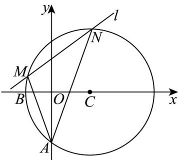

> [!faq]- 《专题09 直线与圆及圆与圆的位置关系全方位总结（九大题型）（高效培优期中专项训练）数学人教A版2019高二选择性必修第一册》官方解析
>
> > [!success]- **【答案】** (1) $(x-3)^{2}+y^{2}=25$ ； (2)证明见解析，定值为 $\frac{3}{4}$
>
> > [!note]- **【分析】**
> > （1）根据给定条件，求出圆 C 的圆心坐标及半径即可作答.
> >
> > (2) 设出直线 $AM, AN$ 的方程，与圆 $C$ 的方程联立，求出点 $M, N$ 的坐标，再用斜率坐标公式计算作答
>
> > [!note]- **【解析】**
> > （1）线段 AB 的中点 $(-1,-2)$ ，直线 AB 的斜率 $k_{AB} = -2$
> >
> > 则线段 $AB$ 中垂线方程为 $y + 2 = \frac{1}{2} (x + 1)$ ，即 $x - 2y - 3 = 0$
> >
> > 依题意，圆 $C$ 的圆心 $C$ 在直线 $x - 2y - 3 = 0$ 上，由 $\left\{ \begin{array}{l} x - 2y - 3 = 0 \\ x - y - 3 = 0 \end{array} \right.$ ，得点 $C(3,0)$ ，
> >
> > 因此圆 $C$ 的半径 $\vert CA\vert = \sqrt{3^2 + 4^2} = 5$
> >
> > 所以圆 C 的标准方程是： $(x-3)^{2}+y^{2}=25$
> >
> > (2) 设直线 $AM$ 方程为： $y = tx - 4$ ，由 $\left\{ \begin{array}{l} y = tx - 4 \\ (x - 3)^2 + y^2 = 25 \end{array} \right.$ 消去 $y$ 并整理得： $(t^2 + 1)x^2 - 2(4t + 3)x = 0$ ，则有点 $M\left(\frac{6 + 8t}{t^2 + 1}, \frac{4t^2 + 6t - 4}{t^2 + 1}\right)$ ，而直线 $AN: y = -tx - 4$ ，同理 $N\left(\frac{6 - 8t}{t^2 + 1}, \frac{4t^2 - 6t - 4}{t^2 + 1}\right)$ ，
> >
> > 于是得直线 $k_{MN}$ 的斜率 $k_{MN} = \frac{\frac{4t^2 + 6t - 4}{t^2 + 1} - \frac{4t^2 - 6t - 4}{t^2 + 1}}{\frac{6 + 8t}{t^2 + 1} - \frac{6 - 8t}{t^2 + 1}} = \frac{3}{4}$
> >
> > 所以直线 l 的斜率是定值，该定值为 $\frac{3}{4}$
> >
> > 
