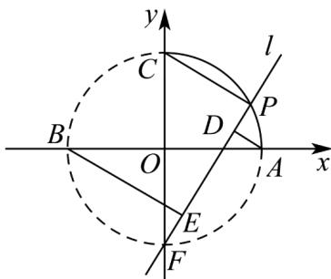

> [!faq]- 《专题09 直线与圆及圆与圆的位置关系全方位总结（九大题型）（高效培优期中专项训练）数学人教A版2019高二选择性必修第一册》官方解析
>
> > [!success]- **【答案】** (1) $x^{2}+y^{2}=1$ 且x 0,y 0 ; (2)证明见解析；
>
> > [!note]- **【分析】**
> > （ $^{1}$ ）利用向量加法、模长的坐标运算，即可求曲线方程；
> >
> > (2) 根据题设 $l: y = kx - 1$ ，且 $k \in [1, +\infty)$ ，应用点线距离公式求 $d_1$ 、 $d_2$ ，并求出 $P$ 的坐标，得到 $2d_1d_2 + |PC|^2$ 关于 $k$ 的表达式，即可证结论：
>
> > [!note]- **【解析】**
> > （1）由题设 $PA=(1-x,-y),PB=(-1-x,-y)$ ，则 $|(-2x,-2y)|=2|(x,y)|=2\Rightarrow x^{2}+y^{2}=1$ ，
> > 所以所求曲线方程为 $x^{2} + y^{2} = 1$ 且 x, 0, y, 0.
> >
> > (2) 由题设及圆的性质，显然直线 $l$ 斜率必存在，
> >
> > 如下图，不妨设 $l:y = kx - 1$ ，且 $k\in [1, + \infty)$
> >
> > 则 $A$ 到 $l$ 的距离为 $d_{1} = \frac{|k - 1|}{\sqrt{1 + k^{2}}}$ ， $B$ 到 $l$ 的距离为 $d_{2} = \frac{|k + 1|}{\sqrt{1 + k^{2}}}$
> >
> > 令 $P(x, kx - 1)$ 且 $x \neq 0$ ，则 $x^{2} + (kx - 1)^{2} = 1 \Rightarrow (1 + k^{2})x^{2} - 2kx = 0$ ，故 $x = \frac{2k}{1 + k^{2}}$ ，
> >
> > 所以 $P\left(\frac{2k}{1 + k^2},\frac{k^2 - 1}{1 + k^2}\right)$ ，则 $|PC|^2 = \left(\frac{2k}{1 + k^2}\right)^2 +\left(\frac{k^2 - 1}{1 + k^2} -1\right)^2 = \frac{4}{1 + k^2}$
> >
> > 综上， $2d_{1}d_{2}+\left|PC\right|^{2}=\frac{2(k^{2}-1)}{1+k^{2}}+\frac{4}{1+k^{2}}=2$ ，为定值.
> >
> > 
