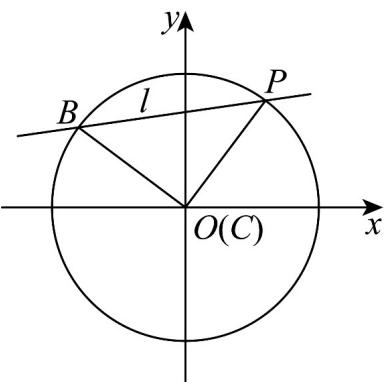

> [!faq]- 《专题09 直线与圆及圆与圆的位置关系全方位总结（九大题型）（高效培优期中专项训练）数学人教A版2019高二选择性必修第一册》官方解析
>
> > [!success]- **【答案】** (1) $x^{2}+y^{2}=25$ (2) $x = 5$ 或 $8x + 15y - 85 = 0$ (3) $x - 7y + 25 = 0$ 或 $7x + y - 25 = 0$
>
> > [!note]- **【分析】**
> > （1）将点 $A$ 、 $P$ 的坐标代入圆 $C$ 的方程，可得出关于 $b$ 、 $r$ 的方程组，解出这两个未知数的值，即可得出圆 $C$ 的方程；
> >
> > (2) 对直线 $m$ 的斜率是否存在进行分类讨论，在直线 $m$ 的斜率不存在时，直接检验即可；在直线 $m$ 的斜率存在时，设出直线 $m$ 的方程，利用圆心到直线的距离等于圆的半径，求出参数值，综合可得出直线 $m$ 的方程；
> >
> > (3) 分析可知，当 $\angle BCP = 90^{\circ}$ 时， $\triangle BCP$ 的面积最大，求出圆心到直线 $BP$ 的距离，然后对直线 $l$ 的斜率是否存在进行分类讨论，在直线 $l$ 的斜率不存在时，直接检验即可；在直线 $l$ 的斜率存在时，设直线 $l$ 的方程为 $y - 4 = t(x - 3)$ ，利用点到直线的距离公式求出 $t$ 的值，由此可得出直线 $l$ 的方程。
>
> > [!note]- **【解析】**
> > （1）由题意可得 $\left\{ \begin{array}{l} (5 - b)^2 = r^2 \\ 3^2 + (4 - b)^2 = r^2 \end{array} \right.$ ，解得 $\left\{ \begin{array}{l} b = 0 \\ r = 5 \end{array} \right.$ ，故圆 $C$ 的方程为 $x^2 + y^2 = 25$
> >
> > (2) 圆 C 的圆心为 $C(0,0)$ ，半径为 5，
> >
> > 若直线 $m$ 的斜率不存在，则直线 $m$ 的方程为 $x = 5$ ，此时，圆心到直线 $m$ 的距离为5，合乎题意；
> >
> > 若直线 $m$ 的斜率存在，设直线 $m$ 的方程为 $y - 3 = k(x - 5)$ ，即 $kx - y - 5k + 3 = 0$
> >
> > 由题意可得 $\frac{|3 - 5k|}{\sqrt{k^2 + 1}} = 5$ ，解得 $k = -\frac{8}{15}$
> >
> > 此时，直线 $m$ 的方程为 $y - 3 = -\frac{8}{15} (x - 5)$ ，即 $8x + 15y - 85 = 0$ .
> >
> > 综上所述，直线 $m$ 的方程为 $x = 5$ 或 $8x + 15y - 85 = 0$
> >
> > (3) 因为 $S_{\triangle BCP} = \frac{1}{2} |BC| \cdot |CP| \sin \angle BCP = \frac{1}{2} \times 5^{2} \times \sin \angle BCP \leq \frac{25}{2}$ ,
> >
> > 当且仅当 $\angle BCP = 90^{\circ}$ 时，等号成立，
> >
> > 此时， $\triangle BCP$ 是等腰直角三角形，且 $\left|BC\right|=\left|CP\right|=5$
> >
> > 则圆心 C 到直线 BP 的距离为 $d = |BC| \sin 45^{\circ} = \frac{5\sqrt{2}}{2}$ ，
> >
> > 当直线 l 的斜率不存在时，直线 l 的方程为 x = 3，此时圆心到直线 l 的距离为 3，不合乎题意，
> >
> > 
> >
> > 所以，直线 $l$ 的斜率存在，设直线 $l$ 的方程为 $y - 4 = t(x - 3)$ ，即 $tx - y + 4 - 3t = 0$
> >
> > 由题意可得 $d = \frac{|4 - 3t|}{\sqrt{t^2 + 1}} = \frac{5\sqrt{2}}{2}$ ，整理得 $7t^2 + 48t - 7 = 0$ ，解得 $t = \frac{1}{7}$ 或 $t = -7$ ，
> >
> > 因此，直线 $l$ 的方程为 $y - 4 = \frac{1}{7}(x - 3)$ 或 $y - 4 = -7(x - 3)$
> >
> > 即直线 l 的方程为 $x - 7y + 25 = 0$ 或 $7x + y - 25 = 0$ .
