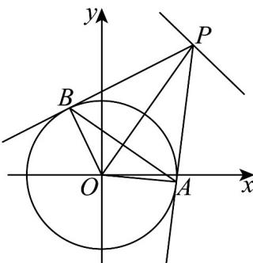

> [!faq]- 《专题09 直线与圆及圆与圆的位置关系全方位总结（九大题型）（高效培优期中专项训练）数学人教A版2019高二选择性必修第一册》官方解析
>
> > [!success]- **【答案】** A. 圆 $O$ 与直线 $l$ 相离 B. $|PA|$ 存在最小值 C. $|AB|$ 存在最大值 D. 存在点 $P$ 使得 $\triangle ABO$ 为直角三角形
>
> > [!note]- **【分析】**
> > 求出圆心 $O$ 到直线的距离判断 ${}^{\mathrm{A}}$ ；利用切线长定理计算判断 ${}^{\mathrm{B}}$ ；利用四边形面积求得 $\left|AB\right| = 4\sqrt{1 - \frac{4}{\left|PO\right|^2}}$ ，借助 $\left|PO\right|$ 的范围求解判断 ${}^{\mathrm{C}}$ ；根据 $\triangle ABO$ 为直角三角形求得 $\left|PO\right| = 2\sqrt{2}$ ，根据圆心到直线的最小距离即可判断 ${}^{\mathrm{D}}$ 。
>
> > [!note]- **【解析】**
> > 圆 $O: x^{2} + y^{2} = 4$ 的圆心 $O(0,0)$ ，半径 r = 2，
> >
> > 对于 $\mathsf{A}$ ，点 $O$ 到直线 $l$ 的距离 $d = \frac{6}{\sqrt{2}} = 3\sqrt{2} >2 = r$ ，故圆 $O$ 与直线 $l$ 相离，正确；
> >
> > 对于 B， $\left|PA\right|=\sqrt{\left|PO\right|^{2}-\left|AO\right|^{2}}=\sqrt{\left|PO\right|^{2}-r^{2}}\quad\sqrt{d^{2}-r^{2}}=\sqrt{14}$
> >
> > 当且仅当 $PO \perp l$ 时取等号，正确；
> >
> > 对于 C，由 PO 垂直平分 AB 得， $S_{PAOB} = \frac{1}{2} |PO||AB| = 2S_{\triangle PAO} = |PA||AO|$
> >
> > 则 $4 > |AB| = \frac{2|PA||AO|}{|PO|} = \frac{4|PA|}{|PO|} = 4\sqrt{1 - \frac{4}{|PO|^2}}$ $4\sqrt{1 - \frac{4}{(3\sqrt{2})^2}} = \frac{4\sqrt{7}}{3}$ ，当且仅当 $PO \perp l$ 时取等号，
> >
> > 所以 $|AB|$ 不存在最大值，错误；
> >
> > 对于 $\mathsf{D}$ ，由A可知， $|PO|\quad d = 3\sqrt{2}$ ，若 $\triangle ABO$ 为直角三角形，则 $\angle AOP = 45^{\circ}$
> >
> > 从而 $\left|PO\right|=\sqrt{2}\left|AO\right|=2\sqrt{2}$ ，又 $2\sqrt{2}<3\sqrt{2}$ ，所以不存在点P使得 $\triangle ABO$ 为直角三角形，错误·故选：AB
> >
> > 
