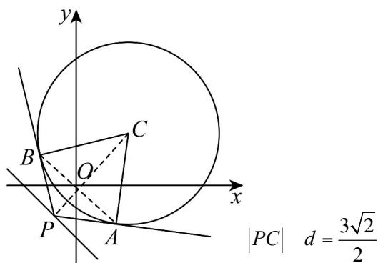

> [!faq]- 《专题09 直线与圆及圆与圆的位置关系全方位总结（九大题型）（高效培优期中专项训练）数学人教A版2019高二选择性必修第一册》官方解析
>
> > [!success]- **【答案】** A. 圆 $C$ 上恰有两个点到直线 $l$ 的距离为 $^{1B}$ . 四边形 $PACB$ 面积的最小值为 $\frac{3\sqrt{2}}{2}$ C. 存在点 $P$ 使 $\angle APB = 120^\circ$ D. 直线 $AB$ 过定点 $(0, 0)$
>
> > [!note]- **【分析】**
> > 根据圆心到直线距离判断 $^{A}$ ，切线长公式即可求解 $^{B}$ ， $^{C}$ ，设出点P的坐标，求出以 $|PC|$ 为直径的圆的方程，利用两圆的方程相减得到公共弦AB的方程，将代入直线AB的方程恒成立，可得答案
>
> > [!note]- **【解析】**
> > 圆心 $C(1,1)$ 到直线 $l:x+y+1=0$ 的距离为 $d=\frac{|1+1+1|}{\sqrt{2}}=\frac{3\sqrt{2}}{2}>\sqrt{3}$ ，
> > 因为圆的半径为 $r=\sqrt{3}$ ，所以 $\frac{3\sqrt{2}}{2}-\sqrt{3}<1$ ，
> > 所以圆C上恰有两个点到直线l的距离为1，所以A正确；
> >
> > 
> >
> > ，因为圆的半径为 ，根据切线长公式可得
> >
> > $$
> > r = \sqrt {3}
> > $$
> >
> > $$
> > \left| P A \right| = \sqrt {\left| P C \right| ^ {2} - r ^ {2}} \quad \sqrt {\frac {9}{2} - 3} = \frac {\sqrt {6}}{2}
> > $$
> >
> > 当 $PC \perp l$ 时取等号，所以 $|PA|$ 的取值范围为 $\left[\frac{\sqrt{6}}{2}, +\infty\right)$
> >
> > 因为 $PA \perp AC$ ，所以四边形 $PACB$ 面积等于 $2 \times S_{\triangle PAC} = |PA| \times |AC| = \sqrt{3} |PA|$ $\sqrt{3} \times \frac{\sqrt{6}}{2} = \frac{3\sqrt{2}}{2}$ ，四边形 $PACB$
> >
> > 面积的最小值为 $\frac{3\sqrt{2}}{2}$ ，故 ${}^{\mathrm{B}}$ 正确；
> >
> > 因为 $\angle APB = 120^{\circ}$ ，所以 $\angle APC = 60^{\circ}$ ，在直角三角形 $APC$ 中， $\frac{|AC|}{|CP|} = \sin 60^{\circ} = \frac{\sqrt{3}}{2}$ ，所以 $|CP| = 2$ ，设 $P(a, - a - 1)$ ，因为 $|CP| = \sqrt{(a - 1)^2 + (-a - 2)^2} = 2$ ，整理得 $2a^{2} + 2a + 1 = 0$ ，方程无解，所以不存在点 $P$ 使 $\angle APB = 120^{\circ}$ ，故C不正确；
> >
> > 对于 $^{D}$ ，设 $P(x_{0},y_{0})$ ，则 $y_{0}=-1-x_{0}$ ， $P(x_{0},-1-x_{0})$ ，以 $\left|PC\right|$ 为直径的圆的圆心为 $\left(\frac{x_{0}+1}{2},\frac{-1-x_{0}+1}{2}\right)$ ，半径为 $\frac{1}{2}\sqrt{(x_{0}-1)^{2}+(-x_{0}-2)^{2}}$ ，
> >
> > 所以以 $|PC|$ 为直径的圆的方程为 $\left(x - \frac{x_0 + 1}{2}\right)^2 +\left(y - \frac{-1 - x_0 + 1}{2}\right)^2 = \frac{2x_0^2 + 2x_0 + 5}{4}$
> >
> > 化简得 $x^{2} + y^{2} - x_{0}x - x + x_{0}y = 1$ ，所以 $AB$ 为圆 $C$ 与以 $\left|PC\right|$ 为直径的圆的公共弦，
> >
> > 联立可得 $\left\{ \begin{array}{l} (x - 1)^2 + (y - 1)^2 = 3 \\ x^2 + y^2 - x_0x - x + x_0y = 1 \end{array} \right.$ ，两式相减可得： $x - x_0x + x_0y + 2y = 0$ ，
> >
> > 即直线 $AB$ 的方程为 $x - x_0x + x_0y + 2y = 0$ ，即 $x(1 - x_0) + y(x_0 + 2) = 0$ ，故直线 $AB$ 过定点 $(0,0)$ ，故D正确；
> >
> > 故选 **ABD**
