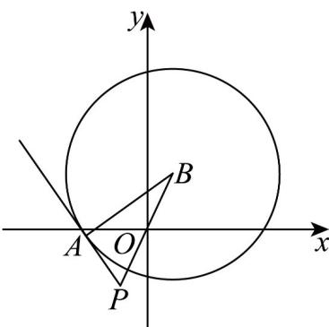

> [!faq]- 《专题09 直线与圆及圆与圆的位置关系全方位总结（九大题型）（高效培优期中专项训练）数学人教A版2019高二选择性必修第一册》官方解析
>
> > [!success]- **【答案】** 2
>
> > [!note]- **【分析】**
> > 根据两点间距离公式得到 $\left|PB\right|$ ，然后利用勾股定理求 $\left|AP\right|$ 即可·
>
> > [!note]- **【解析】**
> > 
> >
> > 由题意得圆 C 的圆心坐标 $B(1,2)$ ，半径 r=4， $BA\perp AP$ ，
> >
> > 则 $\left|PB\right|=\sqrt{\left(-1-1\right)^{2}+\left(-2-2\right)^{2}}=2\sqrt{5}$
> >
> > 所以 $\left|AP\right|=\sqrt{\left|PB\right|^{2}-r^{2}}=2$ .
> >
> > 故答案为：2.
