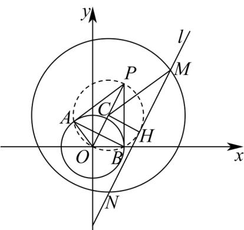

> [!faq]- 《专题09 直线与圆及圆与圆的位置关系全方位总结（九大题型）（高效培优期中专项训练）数学人教A版2019高二选择性必修第一册》官方解析
>
> > [!success]- **【答案】** A．圆 C 与圆 O 相交 B．直线 l 过定点 $(3, 1)$ C．圆 C 被直线 l 截得的弦长的最小值为 $4\sqrt{5}$ D．直线 AB 的方程为 $x + 2y - 2 = 0$
>
> > [!note]- **【分析】**
> > 对于 $A$ ，利用两圆位置关系判断方法即得；对于 $B$ ，将直线 $l$ 的方程按照 $m$ 进行整理，通过解方程组即得；对于 $^{C}$ ，结合图形，利用弦长公式，可知只需使点C到直线l的距离最大 $(CH\perp MN)$ ，利用定点 $H(3,1)$ ，可求得弦长的最小值为 $4\sqrt{5}$ ，但由 $CH\perp MN$ 时，可求得 $k_{l}=2$ ，而 $\frac{2m+1}{m-1}=2$ 无解，排除 $^{C}$ 项；对于 $^{D}$ ，先求出四边形PAOB的外接圆方程，通过两圆方程求出交线即得AB的方程。
>
> > [!note]- **【解析】**
> > 
> >
> > 对于 $\mathsf{A}$ ，由圆 $O:x^{2} + y^{2} = 4$ ，圆 $C:(x - 1)^{2} + (y - 2)^{2} = 25$ ，可得 $O(0,0),C(1,2)$
> >
> > 因 $|OC| = \sqrt{5} < 5 - 2 = 3$ ，则圆 $C$ 与圆 $O$ 内含，则 $^A$ 错误；
> >
> > 对于 B，由 $l:(2m+1)x+(1-m)y-5m-4=0$ 可得 $(2x-y-5)m+(x+y-4)=0$
> >
> > 因 $_{m\in\mathbb{R}}$ ，由 $\left\{\begin{aligned}&2x-y-5=0\\&x+y-4=0\end{aligned}\right.$ ，解得 $\left\{\begin{aligned}x=3\\y=1\end{aligned}\right.$ ，即直线l过定点 $H(3,1)$ ，故 $^{B}$ 正确；
> >
> > 对于 $C$ ，如图，因弦长 $\vert MN\vert = 2\sqrt{R^2 - d^2}$ ，（其中 $R$ 是圆 $C$ 的半径， $d$ 是点 $C$ 到直线 $l$ 的距离），
> >
> > 因 R = 5 ，要使 $\left| MN \right|$ 取最小值，只需 d 最大·
> >
> > 由垂径定理，结合图形可知，当且仅当 $CH \perp MN$ 时， $d_{\max} = |CH| = \sqrt{(1 - 3)^2 + (2 - 1)^2} = \sqrt{5}$
> >
> > 此时圆 $C$ 被直线 $l$ 截得的弦长 $\vert MN\vert$ 的最小值为 $2\sqrt{5^2 - (\sqrt{5})^2} = 4\sqrt{5}$
> >
> > 但此时，直线 $CH$ 的斜率为 $k_{CH} = \frac{2 - 1}{1 - 3} = -\frac{1}{2}$ ，则 $k_{l} = 2$ ，
> >
> > 而由 $l:(2m + 1)x + (1 - m)y - 5m - 4 = 0$ 可得 $k_{l} = \frac{2m + 1}{m - 1}$ ，因 $\frac{2m + 1}{m - 1} = 2$ 方程无解，
> >
> > 故 $|MN|$ 取不到最小值 $4\sqrt{5}$ ，故C错误；
> >
> > 对于 $\mathsf{D}$ ，过点 $P(2,4)$ 作圆 $O$ 的两条切线，切点分别为 $A,B$ ，则 $OA\bot PA,OB\bot PB$ 如图，四边形 PAOB 的外接圆的圆心为 OP 的中点 $(1,2)$ ，圆的半径为 $r=\frac{1}{2}\sqrt{2^{2}+4^{2}}=\sqrt{5}$ ，则该圆的方程为： $(x-1)^{2}+(y-2)^{2}=5$ ，
> > 依题可知直线 AB 为圆 $(x-1)^{2}+(y-2)^{2}=5$ 与 $O: x^{2} + y^{2} = 4$ 的公共弦，
> > 由 $(x-1)^{2}+(y-2)^{2}=5$ 与 $x^{2}+y^{2}=4$ ，两式相减，可得： $x+2y-2=0$ ，故 D 正确。
> > 故选：BD.
> >
> > ## 考点09 圆的公切线问题
