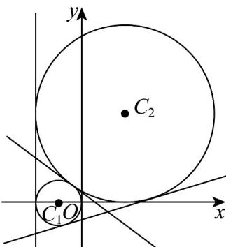
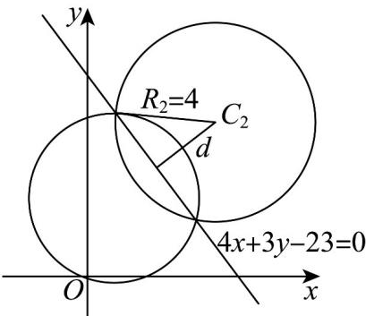

> [!faq]- 《专题09 直线与圆及圆与圆的位置关系全方位总结（九大题型）（高效培优期中专项训练）数学人教A版2019高二选择性必修第一册》官方解析
>
> > [!success]- **【答案】** B
>
> > [!note]- **【分析】**
> > 先求圆心和半径，由题意可知：两圆相交，进而可得结果·
>
> > [!note]- **【解析】**
> > 圆 $O_{1}$ 的方程整理可得 $x^{2}+(y-a)^{2}=1$ ，可知圆心为 $O_{1}(0,a)$ ，半径 $r_{1}=1$ ，
> > 圆 $O_{2}:x^{2}+y^{2}=4$ 的圆心为 $O_{2}(0,0)$ ，半径 $r_{2}=2$ ，
> > 由题意可知：两圆相交，且a>0， $r_{2}-r_{1}=1,r_{2}+r_{1}=3$ ，
> > 所以 $\left|O_{1}O_{2}\right|=a\in(1,3)$ .
> >
> > 故选：B.
> >
> > 64. 以下四个命题表述正确的是（）
> >
> > 【答案】
> >
> > A．若方程 $x^{2}+y^{2}+mx-2y+3=0$ 表示圆，则m的取值范围是 $(-∞,-\sqrt{2})∪(√2,+∞)$ B．直线 $(3+m)x+4y-3+3m=0(m∈R)$ 恒过定点 $(-3,3)$ C．圆 $C_{1}:x^{2}+y^{2}+2x=0$ 与圆 $C_{2}:x^{2}+y^{2}-4x-8y+4=0$ 恰有2条公切线
> >
> > D．已知圆 $C_{1}:x^{2}+y^{2}-2x-6y-1=0$ 和圆 $C_{2}:x^{2}+y^{2}-10x-12y+45=0$ ，圆 $C_{1}$ 和圆 $C_{2}$ 的公共弦长为 $2\sqrt{7}$
> > 【答案】BD
> >
> > 【分析】对于 $^{A}$ 根据圆的一般方程即可求解；对于 $^{B}$ 将直线方程进行重新整理，利用参数分离法进行求解即可；对于 $^{C}$ 通过两圆的位置关系判断公切线条数；对于 $^{D}$ 将两圆作差求出公共弦的方程，圆心到直线的距离公式求出d·利用公式 $2\sqrt{R^{2}-d^{2}}$ 即可求解。
> >
> > 【详解】对于 A：若方程 $x^{2} + y^{2} + mx - 2y + 3 = 0$ 表示圆，
> >
> > 则 $m^2 + (-2)^2 - 4 \times 3 > 0 \Rightarrow m > 2\sqrt{2}$ 或 $m < -2\sqrt{2}$ ，故 $\mathsf{A}$ 错误；
> >
> > 对于 B：直线 $(3+m)x+4y-3+3m=0(m\in\mathbb{R})$ ，得 $m(x+3)+3x+4y-3=0$ ，
> >
> > 由 $\left\{ \begin{array}{l}x + 3 = 0\\ 3x + 4y - 3 = 0 \end{array} \right.$ ，得 $\left\{ \begin{array}{l}x = -3\\ y = 3 \end{array} \right.$ ，即直线恒过定点 $(-3,3)$ ，故B正确；
> >
> > 对于 C：曲线 $C_{1}: x^{2} + y^{2} + 2x = 0$ ，即 $(x + 1)^{2} + y^{2} = 1$ ，圆心为 $C_{1}(-1, 0)$ ，半径为 $r_{1} = 1$ ，
> > 曲线 $C_{2}: x^{2} + y^{2} - 4x - 8y + 4 = 0$ ，即 $(x - 2)^{2} + (y - 4)^{2} = 16$ ，圆心为 $C_{2}(2,4)$ ，半径为 $r_{2} = 4$ ，两圆心的距离为 $\left|C_1C_2\right| = \sqrt{\left(-1 - 2\right)^2 + \left(0 - 4\right)^2} = 5 = 1 + 4 = r_1 + r_2$ ，则两圆外切，有3条公切线，故C错误；
> >
> > 
> >
> > 对于 D : 圆 $C_{1}: x^{2} + y^{2} - 2x - 6y - 1 = 0$ 和圆 $C_{2}: x^{2} + y^{2} - 10x - 12y + 45 = 0$
> >
> > 两方程作差可得公共弦所在的直线方程为 $4x + 3y - 23 = 0$
> >
> > 圆 $C_2: x^2 + y^2 - 10x - 12y + 45 = 0$ 即 $(x - 5)^2 + (y - 6)^2 = 16$
> >
> > 圆心 $C_2(5,6)$ ，半径 $R_{2} = 4$ ，圆心 $C_2(5,6)$ 到直线 $4x + 3y - 23 = 0$ 的距离为 $d = \frac{|4\times 5 + 3\times 6 - 23|}{\sqrt{4^2 + 3^2}} = 3$ ，所以公共弦长为 $2\sqrt{4^2 - 3^2} = 2\sqrt{7}$ ，故D正确．故选：BD．
> >
> > 
