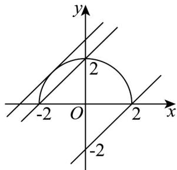

## 专题09 直线与圆及圆与圆的位置关系全方位总结（九大题型）

## 考点归纳

考点01 直线与圆的位置关系求参数

考点02 直线与圆的位置关系求距离最值

考点03 直线与圆定点定值问题

考点04 圆的切线问题

考点05 圆的切线长问题

考点06 圆的弦长与中点弦问题

考点07 由圆与圆的位置关系确定参数取值范围

考点08 相交圆的公共弦方程问题

考点09 圆的公切线问题

## 考点专练

## 考点01 直线与圆的位置关系求参数

1. “ $-2 \leq b < 2$ ”是“直线 $y = x + b$ 与曲线 $y = \sqrt{4 - x^{2}}$ 恰有 1 个公共点”的（）

【答案】
A．充分不必要条件 B．必要不充分条件 C．充分必要条件 D．既不充分也不必要条件

【答案】A

【分析】先分析曲线 $y = \sqrt{4 - x^{2}}$ 的图形，再结合直线 $y = x + b$ 与该曲线的位置关系，再判断 “ $-2 \leq b < 2$ ”

与“直线 $y = x + b$ 与曲线 $y = \sqrt{4 - x^2}$ 恰有1个公共点”之间的条件关系·

【详解】曲线 $y = \sqrt{4 - x^2}$ 表示圆心(0,0)，半径为2的圆的上半部分（包括与 $x$ 轴的交点），

直线 $y = x + b$ 的斜率为 1，在 y 轴上的截距为 b，

当直线 $y = x + b$ 与曲线 $y = \sqrt{4 - x^2}$ 恰有1个公共点时，该直线与曲线相切或有一个交点，

如图所示：

相切时，圆心 $(0,0)$ 到直线 $y = x + b$ 距离等于2，则 $\frac{|b|}{\sqrt{2}} = 2$

即 $b = 2\sqrt{2}$ 或 $b = -2\sqrt{2}$ （舍去，因为当 $b = -2\sqrt{2}$ 时与下半部分相切，不符合题意）·

由图象可知，有一个交点时， $-2 \leq b < 2$

综上可知，当直线 $y = x + b$ 与曲线 $y = \sqrt{4 - x^2}$ 恰有1个公共点时， $-2 \leq b < 2$ 或 $b = 2\sqrt{2}$ .

于是，当“ $-2 \leq b < 2$ ”时，直线“ $y = x + b$ 与曲线 $y = \sqrt{4 - x^2}$ 恰有1个公共点”，则充分性成立；当直线 $y = x + b$ 与曲线 $y = \sqrt{4 - x^2}$ 恰有1个公共点时， $b = 2\sqrt{2}$ 或 $-2 \leq b < 2$ ，则必要性不成立。所以，“ $-2 \leq b < 2$ ”是“直线 $y = x + b$ 与曲线 $y = \sqrt{4 - x^2}$ 恰有1个公共点”的充分不必要条件。故选：A

![[高中/课堂同步/题库/人教A版高中数学同步讲义(2026)/03_选择性必修第一册/期中专项训练+期中模拟卷/专题09 直线与圆及圆与圆的位置关系全方位总结（九大题型）（高效培优期中专项训练）数学人教A版2019高二选择性必修第一册/专题09_直线与圆及圆与圆的位置关系全方位总结_九/questions/Q00079404.md]]
![[高中/课堂同步/题库/人教A版高中数学同步讲义(2026)/03_选择性必修第一册/期中专项训练+期中模拟卷/专题09 直线与圆及圆与圆的位置关系全方位总结（九大题型）（高效培优期中专项训练）数学人教A版2019高二选择性必修第一册/专题09_直线与圆及圆与圆的位置关系全方位总结_九/questions/Q00079405.md]]
![[高中/课堂同步/题库/人教A版高中数学同步讲义(2026)/03_选择性必修第一册/期中专项训练+期中模拟卷/专题09 直线与圆及圆与圆的位置关系全方位总结（九大题型）（高效培优期中专项训练）数学人教A版2019高二选择性必修第一册/专题09_直线与圆及圆与圆的位置关系全方位总结_九/questions/Q00079406.md]]
![[高中/课堂同步/题库/人教A版高中数学同步讲义(2026)/03_选择性必修第一册/期中专项训练+期中模拟卷/专题09 直线与圆及圆与圆的位置关系全方位总结（九大题型）（高效培优期中专项训练）数学人教A版2019高二选择性必修第一册/专题09_直线与圆及圆与圆的位置关系全方位总结_九/questions/Q00079407.md]]
![[高中/课堂同步/题库/人教A版高中数学同步讲义(2026)/03_选择性必修第一册/期中专项训练+期中模拟卷/专题09 直线与圆及圆与圆的位置关系全方位总结（九大题型）（高效培优期中专项训练）数学人教A版2019高二选择性必修第一册/专题09_直线与圆及圆与圆的位置关系全方位总结_九/questions/Q00079408.md]]
![[高中/课堂同步/题库/人教A版高中数学同步讲义(2026)/03_选择性必修第一册/期中专项训练+期中模拟卷/专题09 直线与圆及圆与圆的位置关系全方位总结（九大题型）（高效培优期中专项训练）数学人教A版2019高二选择性必修第一册/专题09_直线与圆及圆与圆的位置关系全方位总结_九/questions/Q00079409.md]]
![[高中/课堂同步/题库/人教A版高中数学同步讲义(2026)/03_选择性必修第一册/期中专项训练+期中模拟卷/专题09 直线与圆及圆与圆的位置关系全方位总结（九大题型）（高效培优期中专项训练）数学人教A版2019高二选择性必修第一册/专题09_直线与圆及圆与圆的位置关系全方位总结_九/questions/Q00079410.md]]
![[高中/课堂同步/题库/人教A版高中数学同步讲义(2026)/03_选择性必修第一册/期中专项训练+期中模拟卷/专题09 直线与圆及圆与圆的位置关系全方位总结（九大题型）（高效培优期中专项训练）数学人教A版2019高二选择性必修第一册/专题09_直线与圆及圆与圆的位置关系全方位总结_九/questions/Q00079411.md]]
![[高中/课堂同步/题库/人教A版高中数学同步讲义(2026)/03_选择性必修第一册/期中专项训练+期中模拟卷/专题09 直线与圆及圆与圆的位置关系全方位总结（九大题型）（高效培优期中专项训练）数学人教A版2019高二选择性必修第一册/专题09_直线与圆及圆与圆的位置关系全方位总结_九/questions/Q00079412.md]]
![[高中/课堂同步/题库/人教A版高中数学同步讲义(2026)/03_选择性必修第一册/期中专项训练+期中模拟卷/专题09 直线与圆及圆与圆的位置关系全方位总结（九大题型）（高效培优期中专项训练）数学人教A版2019高二选择性必修第一册/专题09_直线与圆及圆与圆的位置关系全方位总结_九/questions/Q00079413.md]]
![[高中/课堂同步/题库/人教A版高中数学同步讲义(2026)/03_选择性必修第一册/期中专项训练+期中模拟卷/专题09 直线与圆及圆与圆的位置关系全方位总结（九大题型）（高效培优期中专项训练）数学人教A版2019高二选择性必修第一册/专题09_直线与圆及圆与圆的位置关系全方位总结_九/questions/Q00079414.md]]
![[高中/课堂同步/题库/人教A版高中数学同步讲义(2026)/03_选择性必修第一册/期中专项训练+期中模拟卷/专题09 直线与圆及圆与圆的位置关系全方位总结（九大题型）（高效培优期中专项训练）数学人教A版2019高二选择性必修第一册/专题09_直线与圆及圆与圆的位置关系全方位总结_九/questions/Q00079415.md]]
![[高中/课堂同步/题库/人教A版高中数学同步讲义(2026)/03_选择性必修第一册/期中专项训练+期中模拟卷/专题09 直线与圆及圆与圆的位置关系全方位总结（九大题型）（高效培优期中专项训练）数学人教A版2019高二选择性必修第一册/专题09_直线与圆及圆与圆的位置关系全方位总结_九/questions/Q00079416.md]]
![[高中/课堂同步/题库/人教A版高中数学同步讲义(2026)/03_选择性必修第一册/期中专项训练+期中模拟卷/专题09 直线与圆及圆与圆的位置关系全方位总结（九大题型）（高效培优期中专项训练）数学人教A版2019高二选择性必修第一册/专题09_直线与圆及圆与圆的位置关系全方位总结_九/questions/Q00079417.md]]
![[高中/课堂同步/题库/人教A版高中数学同步讲义(2026)/03_选择性必修第一册/期中专项训练+期中模拟卷/专题09 直线与圆及圆与圆的位置关系全方位总结（九大题型）（高效培优期中专项训练）数学人教A版2019高二选择性必修第一册/专题09_直线与圆及圆与圆的位置关系全方位总结_九/questions/Q00079418.md]]
![[高中/课堂同步/题库/人教A版高中数学同步讲义(2026)/03_选择性必修第一册/期中专项训练+期中模拟卷/专题09 直线与圆及圆与圆的位置关系全方位总结（九大题型）（高效培优期中专项训练）数学人教A版2019高二选择性必修第一册/专题09_直线与圆及圆与圆的位置关系全方位总结_九/questions/Q00079419.md]]
![[高中/课堂同步/题库/人教A版高中数学同步讲义(2026)/03_选择性必修第一册/期中专项训练+期中模拟卷/专题09 直线与圆及圆与圆的位置关系全方位总结（九大题型）（高效培优期中专项训练）数学人教A版2019高二选择性必修第一册/专题09_直线与圆及圆与圆的位置关系全方位总结_九/questions/Q00079420.md]]
![[高中/课堂同步/题库/人教A版高中数学同步讲义(2026)/03_选择性必修第一册/期中专项训练+期中模拟卷/专题09 直线与圆及圆与圆的位置关系全方位总结（九大题型）（高效培优期中专项训练）数学人教A版2019高二选择性必修第一册/专题09_直线与圆及圆与圆的位置关系全方位总结_九/questions/Q00079421.md]]
![[高中/课堂同步/题库/人教A版高中数学同步讲义(2026)/03_选择性必修第一册/期中专项训练+期中模拟卷/专题09 直线与圆及圆与圆的位置关系全方位总结（九大题型）（高效培优期中专项训练）数学人教A版2019高二选择性必修第一册/专题09_直线与圆及圆与圆的位置关系全方位总结_九/questions/Q00079422.md]]
![[高中/课堂同步/题库/人教A版高中数学同步讲义(2026)/03_选择性必修第一册/期中专项训练+期中模拟卷/专题09 直线与圆及圆与圆的位置关系全方位总结（九大题型）（高效培优期中专项训练）数学人教A版2019高二选择性必修第一册/专题09_直线与圆及圆与圆的位置关系全方位总结_九/questions/Q00079423.md]]
![[高中/课堂同步/题库/人教A版高中数学同步讲义(2026)/03_选择性必修第一册/期中专项训练+期中模拟卷/专题09 直线与圆及圆与圆的位置关系全方位总结（九大题型）（高效培优期中专项训练）数学人教A版2019高二选择性必修第一册/专题09_直线与圆及圆与圆的位置关系全方位总结_九/questions/Q00079424.md]]
![[高中/课堂同步/题库/人教A版高中数学同步讲义(2026)/03_选择性必修第一册/期中专项训练+期中模拟卷/专题09 直线与圆及圆与圆的位置关系全方位总结（九大题型）（高效培优期中专项训练）数学人教A版2019高二选择性必修第一册/专题09_直线与圆及圆与圆的位置关系全方位总结_九/questions/Q00079425.md]]
![[高中/课堂同步/题库/人教A版高中数学同步讲义(2026)/03_选择性必修第一册/期中专项训练+期中模拟卷/专题09 直线与圆及圆与圆的位置关系全方位总结（九大题型）（高效培优期中专项训练）数学人教A版2019高二选择性必修第一册/专题09_直线与圆及圆与圆的位置关系全方位总结_九/questions/Q00079426.md]]
![[高中/课堂同步/题库/人教A版高中数学同步讲义(2026)/03_选择性必修第一册/期中专项训练+期中模拟卷/专题09 直线与圆及圆与圆的位置关系全方位总结（九大题型）（高效培优期中专项训练）数学人教A版2019高二选择性必修第一册/专题09_直线与圆及圆与圆的位置关系全方位总结_九/questions/Q00079427.md]]
![[高中/课堂同步/题库/人教A版高中数学同步讲义(2026)/03_选择性必修第一册/期中专项训练+期中模拟卷/专题09 直线与圆及圆与圆的位置关系全方位总结（九大题型）（高效培优期中专项训练）数学人教A版2019高二选择性必修第一册/专题09_直线与圆及圆与圆的位置关系全方位总结_九/questions/Q00079428.md]]
![[高中/课堂同步/题库/人教A版高中数学同步讲义(2026)/03_选择性必修第一册/期中专项训练+期中模拟卷/专题09 直线与圆及圆与圆的位置关系全方位总结（九大题型）（高效培优期中专项训练）数学人教A版2019高二选择性必修第一册/专题09_直线与圆及圆与圆的位置关系全方位总结_九/questions/Q00079429.md]]
![[高中/课堂同步/题库/人教A版高中数学同步讲义(2026)/03_选择性必修第一册/期中专项训练+期中模拟卷/专题09 直线与圆及圆与圆的位置关系全方位总结（九大题型）（高效培优期中专项训练）数学人教A版2019高二选择性必修第一册/专题09_直线与圆及圆与圆的位置关系全方位总结_九/questions/Q00079430.md]]
![[高中/课堂同步/题库/人教A版高中数学同步讲义(2026)/03_选择性必修第一册/期中专项训练+期中模拟卷/专题09 直线与圆及圆与圆的位置关系全方位总结（九大题型）（高效培优期中专项训练）数学人教A版2019高二选择性必修第一册/专题09_直线与圆及圆与圆的位置关系全方位总结_九/questions/Q00079431.md]]
![[高中/课堂同步/题库/人教A版高中数学同步讲义(2026)/03_选择性必修第一册/期中专项训练+期中模拟卷/专题09 直线与圆及圆与圆的位置关系全方位总结（九大题型）（高效培优期中专项训练）数学人教A版2019高二选择性必修第一册/专题09_直线与圆及圆与圆的位置关系全方位总结_九/questions/Q00079432.md]]
![[高中/课堂同步/题库/人教A版高中数学同步讲义(2026)/03_选择性必修第一册/期中专项训练+期中模拟卷/专题09 直线与圆及圆与圆的位置关系全方位总结（九大题型）（高效培优期中专项训练）数学人教A版2019高二选择性必修第一册/专题09_直线与圆及圆与圆的位置关系全方位总结_九/questions/Q00079433.md]]
![[高中/课堂同步/题库/人教A版高中数学同步讲义(2026)/03_选择性必修第一册/期中专项训练+期中模拟卷/专题09 直线与圆及圆与圆的位置关系全方位总结（九大题型）（高效培优期中专项训练）数学人教A版2019高二选择性必修第一册/专题09_直线与圆及圆与圆的位置关系全方位总结_九/questions/Q00079434.md]]
![[高中/课堂同步/题库/人教A版高中数学同步讲义(2026)/03_选择性必修第一册/期中专项训练+期中模拟卷/专题09 直线与圆及圆与圆的位置关系全方位总结（九大题型）（高效培优期中专项训练）数学人教A版2019高二选择性必修第一册/专题09_直线与圆及圆与圆的位置关系全方位总结_九/questions/Q00079435.md]]
![[高中/课堂同步/题库/人教A版高中数学同步讲义(2026)/03_选择性必修第一册/期中专项训练+期中模拟卷/专题09 直线与圆及圆与圆的位置关系全方位总结（九大题型）（高效培优期中专项训练）数学人教A版2019高二选择性必修第一册/专题09_直线与圆及圆与圆的位置关系全方位总结_九/questions/Q00079436.md]]
![[高中/课堂同步/题库/人教A版高中数学同步讲义(2026)/03_选择性必修第一册/期中专项训练+期中模拟卷/专题09 直线与圆及圆与圆的位置关系全方位总结（九大题型）（高效培优期中专项训练）数学人教A版2019高二选择性必修第一册/专题09_直线与圆及圆与圆的位置关系全方位总结_九/questions/Q00079437.md]]
![[高中/课堂同步/题库/人教A版高中数学同步讲义(2026)/03_选择性必修第一册/期中专项训练+期中模拟卷/专题09 直线与圆及圆与圆的位置关系全方位总结（九大题型）（高效培优期中专项训练）数学人教A版2019高二选择性必修第一册/专题09_直线与圆及圆与圆的位置关系全方位总结_九/questions/Q00079438.md]]
![[高中/课堂同步/题库/人教A版高中数学同步讲义(2026)/03_选择性必修第一册/期中专项训练+期中模拟卷/专题09 直线与圆及圆与圆的位置关系全方位总结（九大题型）（高效培优期中专项训练）数学人教A版2019高二选择性必修第一册/专题09_直线与圆及圆与圆的位置关系全方位总结_九/questions/Q00079439.md]]
![[高中/课堂同步/题库/人教A版高中数学同步讲义(2026)/03_选择性必修第一册/期中专项训练+期中模拟卷/专题09 直线与圆及圆与圆的位置关系全方位总结（九大题型）（高效培优期中专项训练）数学人教A版2019高二选择性必修第一册/专题09_直线与圆及圆与圆的位置关系全方位总结_九/questions/Q00079440.md]]
![[高中/课堂同步/题库/人教A版高中数学同步讲义(2026)/03_选择性必修第一册/期中专项训练+期中模拟卷/专题09 直线与圆及圆与圆的位置关系全方位总结（九大题型）（高效培优期中专项训练）数学人教A版2019高二选择性必修第一册/专题09_直线与圆及圆与圆的位置关系全方位总结_九/questions/Q00079441.md]]
![[高中/课堂同步/题库/人教A版高中数学同步讲义(2026)/03_选择性必修第一册/期中专项训练+期中模拟卷/专题09 直线与圆及圆与圆的位置关系全方位总结（九大题型）（高效培优期中专项训练）数学人教A版2019高二选择性必修第一册/专题09_直线与圆及圆与圆的位置关系全方位总结_九/questions/Q00079442.md]]
![[高中/课堂同步/题库/人教A版高中数学同步讲义(2026)/03_选择性必修第一册/期中专项训练+期中模拟卷/专题09 直线与圆及圆与圆的位置关系全方位总结（九大题型）（高效培优期中专项训练）数学人教A版2019高二选择性必修第一册/专题09_直线与圆及圆与圆的位置关系全方位总结_九/questions/Q00079443.md]]
![[高中/课堂同步/题库/人教A版高中数学同步讲义(2026)/03_选择性必修第一册/期中专项训练+期中模拟卷/专题09 直线与圆及圆与圆的位置关系全方位总结（九大题型）（高效培优期中专项训练）数学人教A版2019高二选择性必修第一册/专题09_直线与圆及圆与圆的位置关系全方位总结_九/questions/Q00079444.md]]
![[高中/课堂同步/题库/人教A版高中数学同步讲义(2026)/03_选择性必修第一册/期中专项训练+期中模拟卷/专题09 直线与圆及圆与圆的位置关系全方位总结（九大题型）（高效培优期中专项训练）数学人教A版2019高二选择性必修第一册/专题09_直线与圆及圆与圆的位置关系全方位总结_九/questions/Q00079445.md]]
![[高中/课堂同步/题库/人教A版高中数学同步讲义(2026)/03_选择性必修第一册/期中专项训练+期中模拟卷/专题09 直线与圆及圆与圆的位置关系全方位总结（九大题型）（高效培优期中专项训练）数学人教A版2019高二选择性必修第一册/专题09_直线与圆及圆与圆的位置关系全方位总结_九/questions/Q00079446.md]]
![[高中/课堂同步/题库/人教A版高中数学同步讲义(2026)/03_选择性必修第一册/期中专项训练+期中模拟卷/专题09 直线与圆及圆与圆的位置关系全方位总结（九大题型）（高效培优期中专项训练）数学人教A版2019高二选择性必修第一册/专题09_直线与圆及圆与圆的位置关系全方位总结_九/questions/Q00079447.md]]
![[高中/课堂同步/题库/人教A版高中数学同步讲义(2026)/03_选择性必修第一册/期中专项训练+期中模拟卷/专题09 直线与圆及圆与圆的位置关系全方位总结（九大题型）（高效培优期中专项训练）数学人教A版2019高二选择性必修第一册/专题09_直线与圆及圆与圆的位置关系全方位总结_九/questions/Q00079448.md]]
![[高中/课堂同步/题库/人教A版高中数学同步讲义(2026)/03_选择性必修第一册/期中专项训练+期中模拟卷/专题09 直线与圆及圆与圆的位置关系全方位总结（九大题型）（高效培优期中专项训练）数学人教A版2019高二选择性必修第一册/专题09_直线与圆及圆与圆的位置关系全方位总结_九/questions/Q00079449.md]]
![[高中/课堂同步/题库/人教A版高中数学同步讲义(2026)/03_选择性必修第一册/期中专项训练+期中模拟卷/专题09 直线与圆及圆与圆的位置关系全方位总结（九大题型）（高效培优期中专项训练）数学人教A版2019高二选择性必修第一册/专题09_直线与圆及圆与圆的位置关系全方位总结_九/questions/Q00079450.md]]
![[高中/课堂同步/题库/人教A版高中数学同步讲义(2026)/03_选择性必修第一册/期中专项训练+期中模拟卷/专题09 直线与圆及圆与圆的位置关系全方位总结（九大题型）（高效培优期中专项训练）数学人教A版2019高二选择性必修第一册/专题09_直线与圆及圆与圆的位置关系全方位总结_九/questions/Q00079451.md]]
![[高中/课堂同步/题库/人教A版高中数学同步讲义(2026)/03_选择性必修第一册/期中专项训练+期中模拟卷/专题09 直线与圆及圆与圆的位置关系全方位总结（九大题型）（高效培优期中专项训练）数学人教A版2019高二选择性必修第一册/专题09_直线与圆及圆与圆的位置关系全方位总结_九/questions/Q00079452.md]]
![[高中/课堂同步/题库/人教A版高中数学同步讲义(2026)/03_选择性必修第一册/期中专项训练+期中模拟卷/专题09 直线与圆及圆与圆的位置关系全方位总结（九大题型）（高效培优期中专项训练）数学人教A版2019高二选择性必修第一册/专题09_直线与圆及圆与圆的位置关系全方位总结_九/questions/Q00079453.md]]
![[高中/课堂同步/题库/人教A版高中数学同步讲义(2026)/03_选择性必修第一册/期中专项训练+期中模拟卷/专题09 直线与圆及圆与圆的位置关系全方位总结（九大题型）（高效培优期中专项训练）数学人教A版2019高二选择性必修第一册/专题09_直线与圆及圆与圆的位置关系全方位总结_九/questions/Q00079454.md]]
![[高中/课堂同步/题库/人教A版高中数学同步讲义(2026)/03_选择性必修第一册/期中专项训练+期中模拟卷/专题09 直线与圆及圆与圆的位置关系全方位总结（九大题型）（高效培优期中专项训练）数学人教A版2019高二选择性必修第一册/专题09_直线与圆及圆与圆的位置关系全方位总结_九/questions/Q00079455.md]]
![[高中/课堂同步/题库/人教A版高中数学同步讲义(2026)/03_选择性必修第一册/期中专项训练+期中模拟卷/专题09 直线与圆及圆与圆的位置关系全方位总结（九大题型）（高效培优期中专项训练）数学人教A版2019高二选择性必修第一册/专题09_直线与圆及圆与圆的位置关系全方位总结_九/questions/Q00079456.md]]
