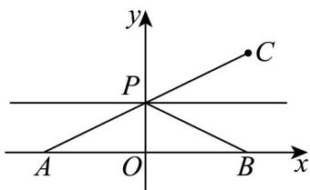

> [!faq]- 《专题10 椭圆标准方程及其性质全方位总结（九大题型）（高效培优期中专项训练）数学人教A版2019高二选择性必修第一册》官方解析
>
> > [!success]- **【答案】** A. 1 B. 2 C. 3 D. 4
>
> > [!note]- **【分析】**
> > 由题意 $P$ 点在椭圆上，再逐项分析直线是否与椭圆有公共点即可得解·
> >
> > $$
> > \left| P M \right| + \left| P N \right| = 1 0 > \left| M N \right| = 6
> > $$
> >
> > $$
> > 2 a = 1 0, 2 c = 6
> > $$
> >
> > $$
> > b ^ {2} = a ^ {2} - c ^ {2} = 1 6
> > $$
> >
> > $$
> > \frac {x ^ {2}}{2 5} + \frac {y ^ {2}}{1 6} = 1
> > $$
> >
> > 由题意，直线与椭圆有公共点即为“D型直线”，
> >
> > 由 $y = x + 1$ 过点 $(0,1)$ ， $\frac{0^{2}}{25} + \frac{1^{2}}{16} < 1$ 知直线过椭圆内的点，故相交，是“D型直线”，
> > 由 b = 4 可知， $y = \frac{4}{3}$ 与椭圆相交，是“D型直线”，y = 5 与椭圆没有公共点，不是“D型直线”，由 a = 5 知 x = -6 与椭圆没有公共点，不是“D型直线”
> >
> > 故选：B
> >
> > 5. 数学家华罗庚曾说：“数缺形时少直观，形少数时难入微。”事实上，很多代数问题可以转化为几何问题加以解决。例如，与 $\sqrt{(x - a)^2 + (y - b)^2}$ 相关的代数问题，可以转化为点 $A(x,y)$ 与点 $B(a,b)$ 之间的距离的几何问题。结合上述观点，对于函数 $f(x) = \sqrt{x^2 + 4x + 5} + \sqrt{x^2 - 4x + 5}$ ，下列结论正确的是（）A. 方程 $f(x) = 5$ 无解 B. 方程 $f(x) = 6$ 有两个解C. $f(x)$ 的最小值为 $2\sqrt{5}$ D. $f(x)$ 的最大值为 $6\sqrt{5}$
> >
> > 【答案】BC
> >
> > 【分析】根据两点间距离公式，结合题意可得 $f(x) = |PA| + |PB|$ ，取 $C(2,2)$ 计算可得A、C、D；结合椭圆定义计算可得B.
>
> > [!note]- **【解析】**
> > $f(x) = \sqrt{x^2 + 4x + 5} + \sqrt{x^2 - 4x + 5} = \sqrt{(x + 2)^2 + 1} + \sqrt{(x - 2)^2 + 1}$ 设 $P(x,1)$ ， $A(-2,0)$ ， $B(2,0)$ ，则 $f(x) = |PA| + |PB|$ 如图，取 $C(2,2)$ ，则 $f(x) = |PA| + |PB| = |PA| + |PC| \quad |AC| = \sqrt{4^2 + 2^2} = 2\sqrt{5}$ ，
> >
> > 当且仅当 A 、 P 、 C 三点共线时，等号成立，
> >
> > 又当 x 2 时， $f(x)$ 随 x 增大而增大，故 $f(x)$ 无最大值，故 C 正确、D 错误；
> >
> > 由 $5 > 2\sqrt{5}$ ，故 $f(x) = 5$ 有解，故A错误；
> >
> > $f(x)=6$ ，则 $\left|PA\right|+\left|PB\right|=6>\left|AB\right|=4$
> >
> > 则 P 的轨迹是以 A，B 为焦点的椭圆，
> >
> > 此时 2a = 6 ， c = 2 ， 即 a = 3 ， $b^{2} = 9 - 4 = 5$
> >
> > 即椭圆方程为 $\frac{x^{2}}{9}+\frac{y^{2}}{5}=1$ ，
> >
> > 当 y=1 时，得 $\frac{x^{2}}{9}=1-\frac{1}{5}=\frac{4}{5}$ ，得 $x^{2}=\frac{36}{5}$ ，即 $x=\pm\frac{6\sqrt{5}}{5}$ ，
> >
> > 即方程 $f(x)=6$ 有两个解，故 B 正确.
> >
> > 故选：BC.
> >
> > 
