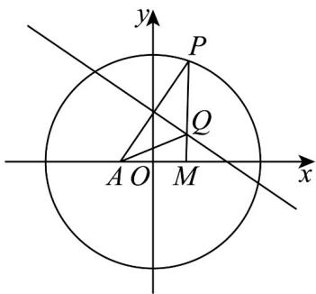

> [!faq]- 《专题10 椭圆标准方程及其性质全方位总结（九大题型）（高效培优期中专项训练）数学人教A版2019高二选择性必修第一册》官方解析
>
> > [!success]- **【答案】** $\frac{x^2}{9} +\frac{y^2}{5} = 1$
>
> > [!note]- **【分析】**
> > 数形结合，分析出动点 $Q$ 满足的条件，再根据椭圆定义，即可求得其方程
>
> > [!note]- **【解析】**
> > 根据题意，作图如下所示：
> >
> > 
> >
> > 由题可知： $\left|PQ\right|=\left|QA\right|$ ，且 $\left|PQ\right|+\left|QM\right|=6$ ，故 $\left|QA\right|+\left|QM\right|=6>\left|AM\right|=4$ ，
> >
> > 故点 $Q$ 的轨迹是椭圆，设其方程为 $\frac{x^2}{a^2} +\frac{y^2}{b^2} = 1(a > b > 0)$
> >
> > 故 $2a = 6$ ， $a = 3$ ， $c = 2$ ，故 $b^{2} = a^{2} - c^{2} = 5$ ，故其方程为： $\frac{x^2}{9} +\frac{y^2}{5} = 1$
> >
> > 故答案为： $\frac{x^{2}}{9}+\frac{y^{2}}{5}=1$
