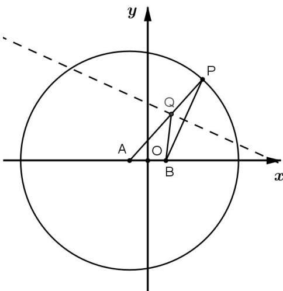

> [!faq]- 《专题10 椭圆标准方程及其性质全方位总结（九大题型）（高效培优期中专项训练）数学人教A版2019高二选择性必修第一册》官方解析
>
> > [!success]- **【答案】** $\frac{x^2}{9} +\frac{y^2}{8} = 1$
>
> > [!note]- **【分析】**
> > 根据题设得到 $\left|QA\right|+\left|QB\right|=\left|QA\right|+\left|QP\right|=\left|AP\right|=6>\left|AB\right|$ ，结合椭圆定义写出轨迹方程即可.
>
> > [!note]- **【解析】**
> > $$
> > \mid Q B \mid = \mid Q P \mid
> > $$
> > $$
> > r = 6
> > $$
> > $$
> > \mid Q A \mid + \mid Q B \mid = \mid Q A \mid + \mid Q P \mid = \mid A P \mid = 6 > \mid A B \mid
> > $$
> > 故 $Q$ 的轨迹是以 $A, B$ 为焦点，且焦点在 $x$ 轴上的椭圆， $a = 3, c = 1$ ，即 $b^2 = 8$ ，所以轨迹方程为 $\frac{x^2}{9} + \frac{y^2}{8} = 1$ .
> > 
> > 故答案为： $\frac{x^{2}}{9}+\frac{y^{2}}{8}=1$
