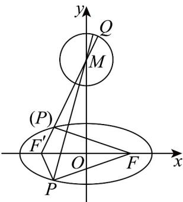

> [!faq]- 《专题10 椭圆标准方程及其性质全方位总结（九大题型）（高效培优期中专项训练）数学人教A版2019高二选择性必修第一册》官方解析
>
> > [!success]- **【答案】** B
>
> > [!note]- **【分析】**
> > 利用椭圆的定义把焦半径进行转化，再把到圆上点的距离最值转化为到圆心，从而即可求两边之和的最小值了.
>
> > [!note]- **【解析】**
> > 
> >
> > 在椭圆 C 中， $a = 4$ ， $b = \sqrt{7}$ ，则 $c = \sqrt{a^{2} - b^{2}} = 3$ ，则 $F(3,0)$ ，则椭圆 C 的左焦点为 $F'(-3,0)$ ，圆 M 的圆心为 $M(0,4)$ ，半径为 1，
> >
> > 由椭圆的定义可得 $\left|PF\right|=2a-\left|PF'\right|=8-\left|PF'\right|$
> >
> > 所以 $\left|PQ\right|-\left|PF\right|=\left|PQ\right|-\left(8-\left|PF'\right|\right)=\left|PQ\right|+\left|PF'\right|-8$
> >
> > 再由圆外的点 $P$ 到圆上动点 $Q$ 的最小值为到圆心的距离减去半径，
> >
> > 所以有 $\left|PQ\right|+\left|PF'\right|-8$ $\left|PM\right|-1+\left|PF'\right|-8=\left|PM\right|+\left|PF'\right|-9$
> >
> > 利用当且仅当 P 、 $F'$ 、 M 三点共线且 P 在线段 $MF'$ 上时， $|PQ| - |PF|$ 取最小值，
> >
> > 所以有 $\left|PM\right|+\left|PF'\right|-9$ $\left|MF'\right|-9=\sqrt{(0+3)^{2}+(4-0)^{2}}-9=5-9=-4$
> >
> > 故 $|PQ|-|PF|$ 的最小值为-4.
> >
> > 故选 **B**.
