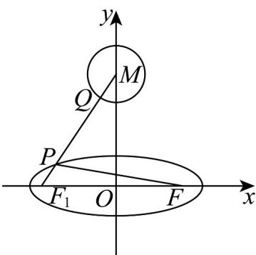

> [!faq]- 《专题10 椭圆标准方程及其性质全方位总结（九大题型）（高效培优期中专项训练）数学人教A版2019高二选择性必修第一册》官方解析
>
> > [!success]- **【答案】** $2\sqrt{6}-7/-7+2\sqrt{6}$
>
> > [!note]- **【分析】**
> > 根据点与圆的位置关系，及椭圆的定义可得 $\left|PQ\right|-\left|PF\right|\quad\left|PM\right|-\left|PF\right|-1=\left|PM\right|+\left|PF_{1}\right|-7\quad\left|MF_{1}\right|-7$ ，即可得最小值.
>
> > [!note]- **【解析】**
> > 
> >
> > 如图所示，
> >
> > 由圆 $M:x^{2} + (y - 4)^{2} = 1$ ，可知圆心 $M(0,4)$ ，半径 $r = 1$
> >
> > 设椭圆 $C: \frac{x^{2}}{9} + y^{2} = 1$ 的左焦点为 $F_{1}(-2\sqrt{2}, 0)$ ，且 2a = 6，
> >
> > 则 $\left|PQ\right|-\left|PF\right|\quad\left|PM\right|-r-\left|PF\right|=\left|PM\right|-\left|PF\right|-1$
> >
> > 再由椭圆定义可知 $\left|PF\right|=2a-\left|PF_{1}\right|=6-\left|PF_{1}\right|$
> >
> > 即 $\left|PQ\right|-\left|PF\right|\quad\left|PM\right|-\left|PF\right|-1=\left|PM\right|+\left|PF_{1}\right|-7\quad\left|MF_{1}\right|-7$
> >
> > 当且仅当点 P，Q 在线段 $MF_{1}$ 上时，等号成立，
> >
> > 又 $\left|MF_1\right| = \sqrt{\left(2\sqrt{2}\right)^2 + 4^2} = 2\sqrt{6}$
> >
> > 即 $\left|PQ\right|-\left|PF\right|$ 的最小值为 $2\sqrt{6}-7$ ，
> >
> > 故答案为： $2\sqrt{6} - 7$
