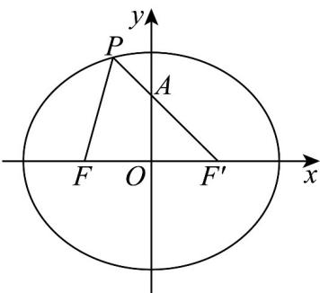

> [!faq]- 《专题10 椭圆标准方程及其性质全方位总结（九大题型）（高效培优期中专项训练）数学人教A版2019高二选择性必修第一册》官方解析
>
> > [!success]- **【答案】** $4-\sqrt{2}/-\sqrt{2}+4$
>
> > [!note]- **【分析】**
> > 结合图形，利用椭圆的定义将所求式转化，判断当 $P, A, F'$ ，三点共线，且点 $A$ 在 $P, F'$ 之间时， $|PA| + |PF|$ 取得最小值即可·
>
> > [!note]- **【解析】**
> > 
> >
> > 如图，设椭圆的右焦点为 $F'$ ，连接 $PF'$ ，
> >
> > 因 $|PF| + |PF'| = 2a = 4$ ，则 $|PA| + |PF| = |PA| + 4 - |PF'| = 4 + |PA| - |PF'|$ 由图知，当 $P, A, F'$ ，三点共线，且点 $A$ 在 $P, F'$ 之间时， $\left|PA\right| - \left|PF'\right|$ 取得最小值 $-\left|AF'\right|$ ，因 $A(0,1), F'(1,0)$ ， $\left|AF'\right| = \sqrt{2}$ ，故此时 $\left|PA\right| + \left|PF\right|$ 取得最小值为 $4 - \sqrt{2}$ 。故答案为： $4 - \sqrt{2}$ 。
