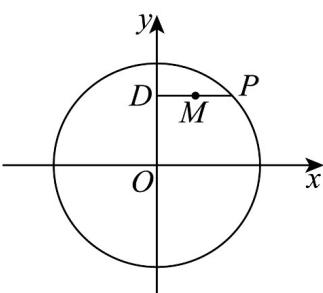

> [!faq]- 《专题10 椭圆标准方程及其性质全方位总结（九大题型）（高效培优期中专项训练）数学人教A版2019高二选择性必修第一册》官方解析
>
> > [!success]- **【答案】** A. $\frac{y^2}{4} + x^2 = 1$ B. $\frac{x^2}{4} + y^2 = 1$ C. $\frac{y^2}{16} + \frac{x^2}{4} = 1$ D. $\frac{x^2}{16} + \frac{y^2}{4} = 1$
>
> > [!note]- **【分析】**
> > 设点 $P\left(x_0,y_0\right)$ 、 $M(x,y)$ ，则 $D\left(0,y_0\right)$ ，由中点坐标公式可得 $\left\{ \begin{array}{l}x_0 = 2x\\ y_0 = y \end{array} \right.$ ，由已知条件可得出 $x_0^2 +y_0^2 = 4$ ，将 $\left\{ \begin{array}{ll}x_0 = 2x\\ y_0 = y \end{array} \right.$ 代入等式 $x_0^2 +y_0^2 = 4$ ，化简可得出轨迹的方程；
>
> > [!note]- **【解析】**
> > 设点 $P(x_0, y_0)$ 、 $M(x, y)$ ，则 $D(0, y_0)$
> >
> > 
> >
> > 由中点的坐标公式可得 $\left\{ \begin{array}{l}x = \frac{x_0}{2}\\ y = y_0 \end{array} \right.$ ，所以， $\left\{ \begin{array}{ll}x_0 = 2x\\ y_0 = y \end{array} \right.$
> >
> > 因为点 P 在圆 O 上，则 $x_{0}^{2} + y_{0}^{2} = 4$ ，则 $(2x)^{2} + y^{2} = 4$ ，整理可得 $\frac{y^{2}}{4} + x^{2} = 1$ 。
> >
> > 因此，轨迹 $M$ 的方程为 $\frac{y^2}{4} + x^2 = 1$ .
> >
> > 故选 **A**.
