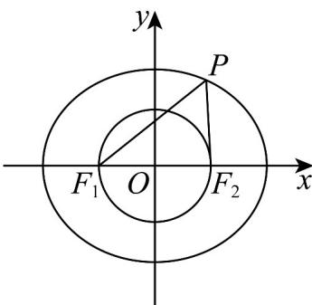

> [!faq]- 《专题10 椭圆标准方程及其性质全方位总结（九大题型）（高效培优期中专项训练）数学人教A版2019高二选择性必修第一册》官方解析
>
> > [!success]- **【答案】** A. $\triangle PF_1F_2$ 的周长为 12 B. $|PF_1|$ 的最小值为 3 C. 存在点 $P$ ，使得 $PF_1 \perp PF_2$ D. $|PF_1| \cdot |PF_2|$ 的最大值为 16
>
> > [!note]- **【分析】**
> > 对于 $^{A}$ ：根据椭圆定义即可判断；对于 $^{B}$ ：根据椭圆性质即可判断；对于 $^{C}$ ：可知点P在以 $F_{1}F_{2}$ 为直径的圆上，分析椭圆与圆的交点情况即可；对于 $^{D}$ ：根据椭圆定义结合基本不等式分析判断·
>
> > [!note]- **【解析】**
> > 由椭圆方程可知： $a = 4, b = 2\sqrt{3}, c = \sqrt{a^2 - b^2} = 2$
> >
> > 则 $\left|PF_{1}\right|+\left|PF_{2}\right|=2a=8,\left|F_{1}F_{2}\right|=2c=4.$
> >
> > 
> >
> > 对于选项 A： $\triangle PF_{1}F_{2}$ 的周长为 $2a + 2c = 12$ ，故 A 正确；
> >
> > 对于选项 B： $\left|PF_{1}\right|$ 的最小值为 a-c=2，故 B 错误；
> >
> > 对于选项C：存在点 $P$ ，使得 $PF_{1} \perp PF_{2}$ ，可知点 $P$ 在以 $F_{1}F_{2}$ 为直径的圆上，
> >
> > 但 $c < b$ ，可知圆与椭圆没有交点，
> >
> > 所以不存在点 P，使得 $PF_{1} \perp PF_{2}$ ，故 C 错误；
> >
> > 对于选项 D：因为 $\left|PF_{1}\right|\cdot\left|PF_{2}\right|\leq\frac{\left(\left|PF_{1}\right|+\left|PF_{2}\right|\right)^{2}}{4}=16$ ，当且仅当 $\left|PF_{1}\right|=\left|PF_{2}\right|=4$ 时，等号成立，
> >
> > 所以 $\left|PF_{1}\right|\cdot\left|PF_{2}\right|$ 的最大值为16，故D正确；
> >
> > 故选 **AD**.
