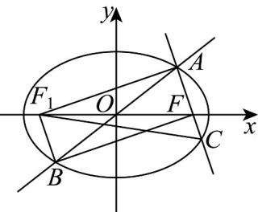

> [!faq]- 《专题10 椭圆标准方程及其性质全方位总结（九大题型）（高效培优期中专项训练）数学人教A版2019高二选择性必修第一册》官方解析
>
> > [!success]- **【答案】** C
>
> > [!note]- **【分析】**
> > 如图，设 $\left|FC\right|=m$ ，根据椭圆的对称性和定义可得 $\left|AF\right|=2a-3m,\left|CF_{1}\right|=2a-m,\left|AC\right|=2a-2m$ ，
> > 在直角 $\triangle AF_{1}C$ 与 $\triangle AF_{1}F$ 中，分别利用勾股定理建立方程，解之即可求解.
>
> > [!note]- **【解析】**
> > 设椭圆的左焦点为 $F_{1}$ ，连接 $AF_{1}, BF_{1}, CF_{1}$ ，
> >
> > <!-- source-part:2 pages:51-66 -->
> >
> > 设 $\left|FC\right|=m$ ，由对称性可知 $\left|AF_{1}\right|=\left|BF\right|=3m$
> >
> > 
> >
> > 由定义得 $\left|AF\right|=2a-3m,\left|CF_{1}\right|=2a-m$ ，则 $\left|AC\right|=2a-2m$
> >
> > 又 $AF_{1} / / BF$ ， $BF\perp AC$ ，所以 $AF_{1}\perp AC$
> >
> > 在直角 $\triangle AF_{1}C$ 中，由 $\left|AF_1\right|^2 +\left|AC\right|^2 = \left|CF_1\right|^2$
> >
> > 即 $9m^{2}+(2a-2m)^{2}=(2a-m)^{2}$ ，解得 $m=\frac{a}{3}$ .
> >
> > 在直角 $\triangle AF_{1}F$ 中， $\left|AF_{1}\right|^{2} + \left|AF\right|^{2} = \left|FF_{1}\right|^{2}$ ，即 $9m^{2} + (2a - 3m)^{2} = (2c)^{2}$
> >
> > 把 $m = \frac{a}{3}$ 代入整理得 $\frac{c^2}{a^2} = \frac{1}{2}$ ，由 $0 < e < 1$ 解得 $e = \frac{c}{a} = \frac{\sqrt{2}}{2}$ .
> >
> > 故选 **C**
