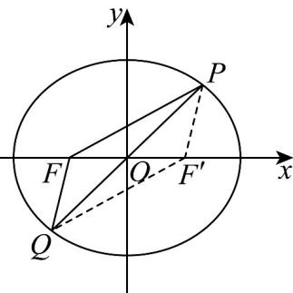

> [!faq]- 《专题10 椭圆标准方程及其性质全方位总结（九大题型）（高效培优期中专项训练）数学人教A版2019高二选择性必修第一册》官方解析
>
> > [!success]- **【答案】** C
>
> > [!note]- **【分析】**
> > 根据椭圆定义求出 $\left|PF'\right|=\left|QF\right|=\frac{4}{3}$ ， $\left|PF\right|=\frac{8}{3}$ 后，再利用余弦定理解三角形计算即可求解.
>
> > [!note]- **【解析】**
> > 设 $F^{\prime}$ 为 $C$ 的右焦点，连接 $PF^{\prime}$ ， $QF^{\prime}$ ，如图，则四边形 $PFQF^{\prime}$ 为平行四边形，
> >
> > $\therefore \left|QF\right| = \left|PF'\right|$ ，由椭圆定义知， $\left|PF\right| + \left|PF'\right| = 2\left|QF\right| + \left|QF\right| = 4$
> >
> > $\therefore \left|PF^{\prime}\right| = \left|QF\right| = \frac{4}{3},\mid PF\mid = \frac{8}{3}.$
> >
> > 在中， $\cos \angle FPF' = \frac{|PF|^2 + |PF'|^2 - |FF'|^2}{2|PF||PF'|} = \frac{\left(\frac{8}{3}\right)^2 + \left(\frac{4}{3}\right)^2 - 2^2}{2 \times \frac{8}{3} \times \frac{4}{3}} = \frac{11}{16}$
> >
> > $$
> > \therefore \cos \angle Q F P = \cos (\pi - \angle F P F ^ {\prime}) = - \cos \angle F P F ^ {\prime} = - \frac {1 1}{1 6}.
> > $$
> >
> > 在 $\triangle PQF$ 中， $|PQ| = \sqrt{|PF|^2 + |QF|^2 - 2|PF||QF|\cos\angle PFQ} = \sqrt{\left(\frac{8}{3}\right)^2 + \left(\frac{4}{3}\right)^2 - 2 \times \frac{8}{3} \times \frac{4}{3} \times \left(-\frac{11}{16}\right)} = \frac{2\sqrt{31}}{3}$ .
> >
> > 
> >
> > 故选 **C**.
