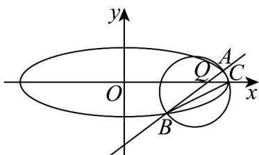

> [!faq]- 《专题10 椭圆标准方程及其性质全方位总结（九大题型）（高效培优期中专项训练）数学人教A版2019高二选择性必修第一册》官方解析
>
> > [!success]- **【答案】** (1) $\frac{x^{2}}{9}+y^{2}=1$ (2) $\frac{3}{8}$
>
> > [!note]- **【分析】**
> > （1）根据题干条件列出等式 $\frac{c}{a} = \frac{2\sqrt{2}}{3}, a = 3$ ，结合 $a^2 = b^2 + c^2$ ，即得解；
> >
> > (2) 联立直线与椭圆方程，根据 $\overline{CA} \cdot \overline{CB} = 0$ 得出 $m = \frac{12}{5}$ ，即直线过定点 $Q\left(\frac{12}{5}, 0\right)$ ，进而表示 $S_{\triangle ABC} = \frac{1}{2} |QC| \cdot |y_1 - y_2| = \frac{1}{2} \times \frac{3}{5} \cdot |y_1 - y_2|$ ，代入韦达定理，换元法求解最值即可.
>
> > [!note]- **【解析】**
> > （1）由题意，设椭圆 $M$ 方程为 $\frac{x^2}{a^2} +\frac{y^2}{b^2} = 1(a > b > 0)$
> >
> > 由于椭圆离心率为 $\frac{2\sqrt{2}}{3}$ ，且过点 $(3,0)$ ，
> >
> > 则 $\frac{c}{a} = \frac{2\sqrt{2}}{3}, a = 3$ ，解得 $a = 3, c = 2\sqrt{2}, b = \sqrt{a^2 - c^2} = 1$ ，
> >
> > 故椭圆 M 的标准方程为： $\frac{x^{2}}{9}+y^{2}=1$ ；
> >
> > (2) 联立 $\left\{\begin{aligned}x&=ky+m\\ \frac{x^{2}}{9}&+y^{2}=1\end{aligned}\right.$ ，可得 $(k^{2}+9)x^{2}+2kmy+m^{2}-9=0$
> >
> > 设 $A(x_{1},y_{1}),B(x_{2},y_{2})$ ，则当 $\Delta >0$ 时有 $y_{1} + y_{2} = -\frac{2km}{k^{2} + 9},y_{1}y_{2} = \frac{m^{2} - 9}{k^{2} + 9}$
> >
> > 若以 AB 为直径的圆经过定点 $C(3,0)$ ，所以 $\overline{CA} \cdot \overline{CB} = 0$
> >
> > 由 $\overline{CA}=(x_{1}-3,y_{1}),\overline{CB}=(x_{2}-3,y_{2})$ ，得 $(x_{1}-3)(x_{2}-3)+y_{1}y_{2}=0$
> >
> > 将 $x_{1} = ky_{1} + m, x_{2} = ky_{2} + m$ 代入可得 $(k^{2} + 1)y_{1}y_{2} + k(m - 3)(y_{1} + y_{2}) + (m - 3)^{2} = 0$
> >
> > 代入韦达定理可得： $(k^2 +1)\times \frac{m^2 - 9}{k^2 + 9} +k(m - 3)\times \left(-\frac{2km}{k^2 + 9}\right) + (m - 3)^2 = 0$
> >
> > 化简可得 $5m^{2} - 27m + 36 = 0$ ，因 $_{m\neq 3}$ ，得 $m = \frac{12}{5}$
> >
> > 则直线 $l: x = ky + \frac{12}{5}$ ，故直线过定点 $Q\left(\frac{12}{5}, 0\right)$
> >
> > $$
> > \left| \right. S _ {\triangle A B C} = \frac {1}{2} \left| Q C \right| \cdot \left| y _ {1} - y _ {2} \right| = \frac {1}{2} \times \left(3 - \frac {1 2}{5}\right) \sqrt {\left(y _ {1} + y _ {2}\right) ^ {2} - 4 y _ {1} y _ {2}} = \frac {3}{1 0} \sqrt {\left(- \frac {2 k m}{k ^ {2} + 9}\right) ^ {2} - 4 \times \frac {m ^ {2} - 9}{k ^ {2} + 9}}
> > $$
> >
> > $$
> > = \frac {9}{5} \sqrt {\frac {k ^ {2} - m ^ {2} + 9}{\left(k ^ {2} + 9\right) ^ {2}}} = \frac {9}{2 5} \sqrt {\frac {2 5 k ^ {2} + 8 1}{\left(k ^ {2} + 9\right) ^ {2}}} = \frac {9}{2 5} \sqrt {\frac {2 5 (k ^ {2} + 9) - 1 4 4}{(k ^ {2} + 9) ^ {2}}}
> > $$
> >
> > 令 $t = \frac{1}{k^2 + 9} \in \left(0, \frac{1}{9}\right]$ ，则 $S_{\triangle ABC} = \frac{9}{25}\sqrt{-144t^2 + 25t}$ ，
> >
> > 当 $t = \frac{25}{288} \in \left(0, \frac{1}{9}\right]$ 时， $S_{\triangle ABC}$ 取得最大值 $\frac{3}{8}$ .
> >
> > 
