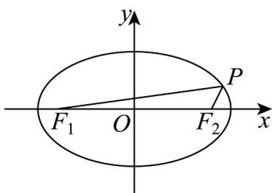

> [!faq]- 《专题10 椭圆标准方程及其性质全方位总结（九大题型）（高效培优期中专项训练）数学人教A版2019高二选择性必修第一册》官方解析
>
> > [!success]- **【答案】** $3\sqrt{3}$ $\frac{\sqrt{3}}{3} / \frac{1}{3}\sqrt{3}$
>
> > [!note]- **【分析】**
> > 利用椭圆的定义及余弦定理求出 $\left|PF_{1}\right|\left|PF_{2}\right|$ ，即可求出 $\triangle PF_{1}F_{2}$ 的面积，再由等面积法求出 $\triangle PF_{1}F_{2}$ 内切圆的半径．
>
> > [!note]- **【解析】**
> > 由椭圆方程可得 a = 5 ， b = 3 ，则 c = 4 ，
> >
> > $$
> > \therefore \left| P F _ {1} \right| + \left| P F _ {2} \right| = 1 0, \quad \left| F _ {1} F _ {2} \right| = 8
> > $$
> >
> > 在 $\triangle PF_{1}F_{2}$ 中， $\cos \angle F_{1}PF_{2} = \frac{\left|PF_{1}\right|^{2} + \left|PF_{2}\right|^{2} - \left|F_{1}F_{2}\right|^{2}}{2\left|PF_{1}\right|\left|PF_{2}\right|} = \frac{\left(\left|PF_{1}\right| + \left|PF_{2}\right|\right)^{2} - 2\left|PF_{1}\right|\left|PF_{2}\right| - \left|F_{1}F_{2}\right|^{2}}{2\left|PF_{1}\right|\left|PF_{2}\right|}$ ，
> >
> > 即 $\frac{1}{2} = \frac{100 - 2\left|PF_1\right|\left|PF_2\right| - 64}{2\left|PF_1\right|\left|PF_2\right|}$ ，解得 $\left|PF_1\right|\left|PF_2\right| = 12$
> >
> > $$
> > \therefore S _ {\triangle P F _ {2} F _ {1}} = \frac {1}{2} \left| P F _ {1} \right| \left| P F _ {2} \right| \sin 6 0 ^ {\circ} = \frac {1}{2} \times 1 2 \times \frac {\sqrt {3}}{2} = 3 \sqrt {3}
> > $$
> >
> > 设 $\triangle PF_{1}F_{2}$ 内切圆半径为 $r$ ， $\triangle PF_{1}F_{2}$ 的周长为 $l = 2a + 2c = 18$
> >
> > 所以 $S_{VPF_{1}F_{2}}=\frac{1}{2}lr=9r=3\sqrt{3}$ ，解得 $r=\frac{\sqrt{3}}{3}$ .
> >
> > 故答案为： $3\sqrt{3}$ ; $\frac{\sqrt{3}}{3}$ .
> >
> > 
