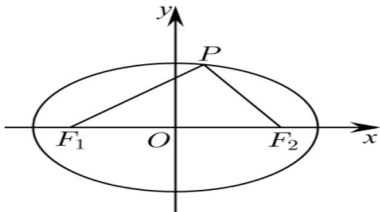

> [!faq]- 《专题10 椭圆标准方程及其性质全方位总结（九大题型）（高效培优期中专项训练）数学人教A版2019高二选择性必修第一册》官方解析
>
> > [!success]- **【答案】** B
>
> > [!note]- **【分析】**
> > 设 $m = \left|PF_{1}\right|$ ， $n = \left|PF_{2}\right|$ ，利用向量的数量积和三角形面积公式，可得到 $\angle F_1PF_2$ ， $mn = 4$ ，又 $2a = m + n$ ，利用基本不等式进行求解即可·
>
> > [!note]- **【解析】**
> > 如图所示：
> >
> > 
> >
> > 不妨设 $m = \left| PF_{1} \right|$ ， $n = \left| PF_{2} \right|$ ， $(m > 0, n > 0)$ ， $\theta = \angle F_{1}PF_{2}$ ，
> >
> > 则可知 $PF_{1} \cdot PF_{2} = mn \cos \theta = -2$ ， $S_{\triangle PF_1F_2} = \frac{1}{2} mn \sin \theta = \sqrt{3}$
> >
> > 两式相除可得 $\frac{1}{2}\tan \theta = -\frac{\sqrt{3}}{2}$ ，所以 $\tan \theta = -\sqrt{3}$
> >
> > 又 $\theta \in (0,\pi)$ ，所以 $\theta = \frac{2\pi}{3}$
> >
> > 则由 $mn\cos \theta = -2$ 得 $-\frac{1}{2} mn = -2$ ，可得 $mn = 4 (m > 0, n > 0)$
> >
> > 由椭圆的定义，得 $2a = m + n - 2\sqrt{mn} = 4$ （当且仅当 $m = n = 2$ 时等号成立），
> >
> > 所以 a 2，
> >
> > 所以 a 的最小值为 2·
> >
> > 故选 **B**.
