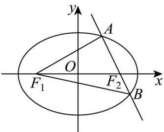

## 考点 06 求椭圆离心率定值问题

46. 椭圆 $C: \frac{x^2}{8} + \frac{y^2}{4} = 1$ 的两个焦点分别为 $F_1, F_2, O$ 为坐标原点，以下说法正确的是（）

【答案】

A. 椭圆 $C$ 的离心率为 $\frac{\sqrt{2}}{2}$

B．椭圆 C 上不存在点 P，使得 $PF_{1} \cdot PF_{2} = 0$

C．过点 $F_{2}$ 的直线与椭圆C交于A，B两点，则 $\triangle ABF_{1}$ 的面积最大值为 $4\sqrt{2}$

D．定义曲线 $\Gamma:\frac{8}{x^{2}}+\frac{4}{y^{2}}=1$ 为椭圆 C 的伴随曲线，则曲线 $\Gamma$ 与椭圆 C 无公共点

【答案】ACD

【分析】对 A，利用直接法求出离心率；对 B，以 $F_{1}F_{2}$ 为直径的圆的半径 r=2=b ，可得存在 $P(0,\pm2)$ ，得解；对 C，设直线 AB 的方程为 $x=my+2$ ，根据 $S_{\triangle ABF_{1}}=\frac{1}{2}|F_{1}F_{2}|\cdot|y_{1}-y_{2}|$ ，联立直线与椭圆方程，利用韦达定理结合基本不等式求出 $\left|y_{1}-y_{2}\right|$ 的最大值得解；对 $^{D}$ ，联立曲线 $\Gamma$ 和椭圆C方程求解判断·

【详解】对于 A，由椭圆 $C: \frac{x^{2}}{8} + \frac{y^{2}}{4} = 1$ 的方程可得 $a^{2} = 8, b^{2} = 4$ ，

所以离心率 $e = \frac{c}{a} = \sqrt{1 - \frac{b^2}{a^2}} = \sqrt{1 - \frac{4}{8}} = \frac{\sqrt{2}}{2}$ ，故 $A$ 正确；

对于 B，由题意可得 c=2 ，所以以 $F_{1}F_{2}$ 为直径的圆的半径 r=2=b

所以当 $P$ 为 $(0, \pm 2)$ ，存在 $P$ 使得 $PF_{1} \cdot PF_{2} = 0$ ；故 $B$ 错误；

对于 $C$ ，显然直线 $AB$ 的斜率不为 $0$ ，设直线 $AB$ 的方程为 $x = my + 2$ ，设 $A(x_{1},y_{1})$ ， $B(x_{2},y_{2})$

联立 $\left\{\begin{aligned}x&=my+2\\\frac{x^{2}}{8}&+\frac{y^{2}}{4}=1\end{aligned}\right.$ ，整理可得 $(2+m^{2})y^{2}+4my-4=0$

$$
y _ {1} + y _ {2} = - \frac {4 m}{2 + m ^ {2}}, y _ {1} y _ {2} = \frac {- 4}{2 + m ^ {2}}
$$

所以 $|y_{1} - y_{2}| = \sqrt{(y_{1} + y_{2})^{2} - 4y_{1}y_{2}} = \sqrt{\frac{16m^{2}}{(2 + m^{2})^{2}} + \frac{16}{2 + m^{2}}} = 4\sqrt{2}\cdot \sqrt{\frac{1 + m^{2}}{(2 + m^{2})^{2}}}$

$$
= 4 \sqrt {2} \cdot \sqrt {\frac {1}{\left(1 + m ^ {2}\right) + \frac {1}{1 + m ^ {2}} + 2}} \leq 4 \sqrt {2} \cdot \sqrt {\frac {1}{2 \sqrt {\left(1 + m ^ {2}\right) \cdot \frac {1}{1 + m ^ {2}}} + 2}} = 2 \sqrt {2},
$$

当且仅当 $1 + m^2 = \frac{1}{1 + m^2}$ ，即 $m = 0$ 时取等号，

所以 $S_{\triangle ABF_1} = \frac{1}{2}|F_1F_2|\cdot |y_1 - y_2|\leq \frac{1}{2}\cdot 4\cdot 2\sqrt{2} = 4\sqrt{2}$ ，故C正确；

对于D，联立 $\left\{ \begin{array}{l} \frac{8}{x^2} + \frac{4}{y^2} = 1 \\ \frac{x^2}{8} + \frac{y^2}{4} = 1 \end{array} \right.$ ，两式相乘可得： $1 + 1 + \frac{x^2}{2y^2} + \frac{2y^2}{x^2} = 1$

可得 $\frac{x^2}{2y^2} +\frac{2y^2}{x^2} = -1$ ，显然不成立，即两个曲线无交点，故D正确·

故选：ACD.

![[高中/课堂同步/题库/人教A版高中数学同步讲义(2026)/03_选择性必修第一册/期中专项训练+期中模拟卷/专题10 椭圆标准方程及其性质全方位总结（九大题型）（高效培优期中专项训练）数学人教A版2019高二选择性必修第一册/考点_06_求椭圆离心率定值问题/questions/Q00079500.md]]
![[高中/课堂同步/题库/人教A版高中数学同步讲义(2026)/03_选择性必修第一册/期中专项训练+期中模拟卷/专题10 椭圆标准方程及其性质全方位总结（九大题型）（高效培优期中专项训练）数学人教A版2019高二选择性必修第一册/考点_06_求椭圆离心率定值问题/questions/Q00079501.md]]
![[高中/课堂同步/题库/人教A版高中数学同步讲义(2026)/03_选择性必修第一册/期中专项训练+期中模拟卷/专题10 椭圆标准方程及其性质全方位总结（九大题型）（高效培优期中专项训练）数学人教A版2019高二选择性必修第一册/考点_06_求椭圆离心率定值问题/questions/Q00079502.md]]
![[高中/课堂同步/题库/人教A版高中数学同步讲义(2026)/03_选择性必修第一册/期中专项训练+期中模拟卷/专题10 椭圆标准方程及其性质全方位总结（九大题型）（高效培优期中专项训练）数学人教A版2019高二选择性必修第一册/考点_06_求椭圆离心率定值问题/questions/Q00079503.md]]
