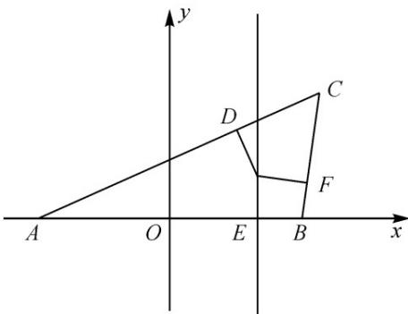

> [!faq]- 《专题11 双曲线标准方程及其性质全方位总结（十大题型）（高效培优期中专项训练）数学人教A版2019高二选择性必修第一册》官方解析
>
> > [!success]- **【答案】** A. $\frac{x^2}{4} - \frac{y^2}{5} = 1 (x > 1)$ B. $x^2 - \frac{y^2}{3} = 1 (x > 1)$ C. $\frac{x^2}{9} + \frac{y^2}{5} = 1 (0 < x < 1)$ D. $\frac{x^2}{9} + \frac{y^2}{4} = 1 (0 < x < 1)$
>
> > [!note]- **【分析】**
> > 根据三角形内切圆的性质，结合双曲线的定义，可得答案·
>
> > [!note]- **【解析】**
> > 如图，设 $\forall ABC$ 与圆的切点分别为 $D, E, F$ ，则有 $|AD| = |AE| = 2, |BF| = |BE| = 1, |CD| = |CF|$ ，所以 $|CA| - |CB| = 3 - 1 = 2$ .
> >
> > 根据双曲线定义，所求轨迹是以 $A, B$ 为焦点，实轴长为 $2$ 的双曲线的右支（右顶点除外），
> >
> > 即 $c = 2, a = 1$ ，又 $c^2 = a^2 + b^2$ ，所以 $b^2 = 3$ ，所以方程为 $x^2 - \frac{y^2}{3} = 1 (x > 1)$ .
> >
> > 故选：B.
> >
> > 
