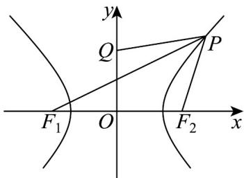

> [!faq]- 《专题11 双曲线标准方程及其性质全方位总结（十大题型）（高效培优期中专项训练）数学人教A版2019高二选择性必修第一册》官方解析
>
> > [!success]- **【答案】** D
>
> > [!note]- **【分析】**
> > 首先利用双曲线的定义转化 $\left|PQ\right|+\left|PF_{1}\right|=\left|PQ\right|+\left(\left|PF_{2}\right|+2\sqrt{2}\right)$ ，再结合图象，求 $\left|PQ\right|+\left|PF_{2}\right|$ 的最小值，再联立方程求交点坐标·
>
> > [!note]- **【解析】**
> > 由题意并结合双曲线的定义可得 $\left|PQ\right|+\left|PF_{1}\right|=\left|PQ\right|+\left(\left|PF_{2}\right|+2\sqrt{2}\right)=\left|PQ\right|+\left|PF_{2}\right|+2\sqrt{2}\quad\left|QF_{2}\right|+2\sqrt{2}=2\sqrt{2}+2\sqrt{2}=4\sqrt{2}$ 当且仅当 Q, P, $F_{2}$ 三点共线时等号成立.
> > 而直线 $QF_{2}$ 的方程为 $y = -x + 2$ ，由 $\left\{\begin{aligned}y &=-x+2\\ x^{2}-y^{2}&=2\end{aligned}\right.$ 可得 $x=\frac{3}{2}$ ，所以 $y=\frac{1}{2}$ ，
> > 所以点 P 的坐标为 $\left(\frac{3}{2},\frac{1}{2}\right)$ .
> > 所以当且仅当点 P 的坐标为 $\left(\frac{3}{2},\frac{1}{2}\right)$ 时， $\left|PQ\right|+\left|PF_{1}\right|$ 的最小值为 $4\sqrt{2}$
> >
> > 
> >
> > 故选 **D**.
